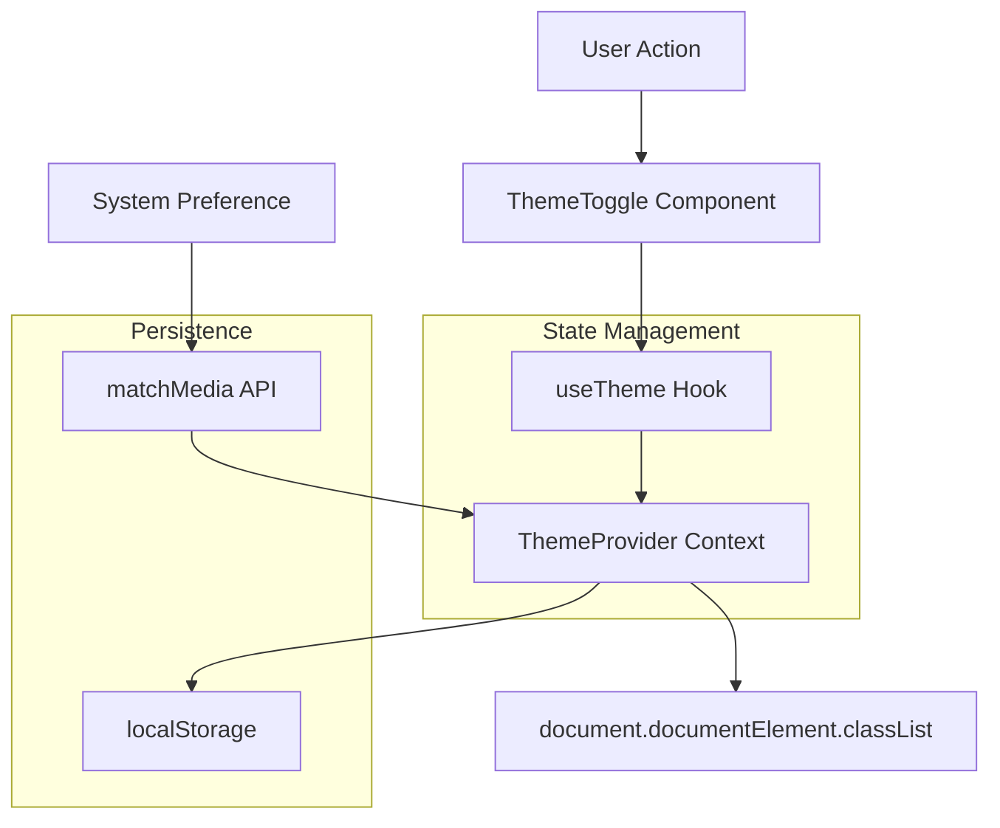

# Design Document: Dark Mode

## Overview

This feature implements a dark mode theme toggle for the Wallet application. The implementation leverages the existing CSS variable system and Tailwind's class-based dark mode configuration. Users can toggle between light and dark themes, with preferences persisted in localStorage and system preferences respected for new users.

## Architecture

The dark mode implementation follows a simple client-side architecture:



### Theme Resolution Order

1. Check localStorage for saved preference
2. If no saved preference, check system preference via `matchMedia`
3. Apply resolved theme to document root element

## Components and Interfaces

### 1. ThemeProvider Component

Context provider that manages theme state and provides toggle functionality.

```typescript
interface ThemeProviderProps {
  children: React.ReactNode;
  defaultTheme?: 'light' | 'dark' | 'system';
  storageKey?: string;
}

interface ThemeContextValue {
  theme: 'light' | 'dark' | 'system';
  resolvedTheme: 'light' | 'dark';
  setTheme: (theme: 'light' | 'dark' | 'system') => void;
}
```

### 2. useTheme Hook

Custom hook to access theme context.

```typescript
function useTheme(): ThemeContextValue;
```

### 3. ThemeToggle Component

UI component for toggling between themes.

```typescript
interface ThemeToggleProps {
  className?: string;
}
```

## Data Models

### Theme State

```typescript
type Theme = 'light' | 'dark' | 'system';

interface ThemeState {
  theme: Theme;
  resolvedTheme: 'light' | 'dark';
}
```

### LocalStorage Schema

```typescript
// Key: 'wallet-theme'
// Value: 'light' | 'dark' | 'system'
```

## Correctness Properties

*A property is a characteristic or behavior that should hold true across all valid executions of a system-essentially, a formal statement about what the system should do. Properties serve as the bridge between human-readable specifications and machine-verifiable correctness guarantees.*

### Property 1: Theme toggle round-trip
*For any* theme state (light or dark), clicking the toggle should switch to the opposite theme and update the document class accordingly.
**Validates: Requirements 1.1, 1.2**

### Property 2: Theme persistence round-trip
*For any* theme selection, the value stored in localStorage should match the selected theme, and reloading should restore that theme.
**Validates: Requirements 1.3, 1.4**

### Property 3: System preference detection
*For any* system color scheme preference (light or dark), when no localStorage value exists, the application should initialize with the system preference.
**Validates: Requirements 2.1, 2.2, 2.3**

### Property 4: Manual override precedence
*For any* manually selected theme, the selection should take precedence over system preference on subsequent loads.
**Validates: Requirements 2.4**

### Property 5: Theme icon state consistency
*For any* theme state, the toggle icon should reflect the current theme (sun for light, moon for dark).
**Validates: Requirements 4.2**

## Error Handling

| Scenario | Handling |
|----------|----------|
| localStorage unavailable | Fall back to system preference, no persistence |
| matchMedia unavailable | Default to light theme |
| Invalid localStorage value | Clear and use system preference |

## Testing Strategy

### Unit Testing

Unit tests will verify:
- ThemeProvider initialization with different scenarios
- useTheme hook behavior
- ThemeToggle component rendering and interaction
- localStorage read/write operations

### Property-Based Testing

Property-based tests using fast-check will verify:
- Theme toggle produces correct state transitions
- Persistence round-trip maintains theme value
- System preference detection works correctly

**Testing Framework**: Vitest with React Testing Library and fast-check for property-based testing

### Test Scenarios

1. **Initial Load - No Preference**
   - Mock matchMedia to return dark preference
   - Verify dark class applied to document

2. **Initial Load - Saved Preference**
   - Set localStorage to 'light'
   - Mock matchMedia to return dark
   - Verify light class applied (localStorage wins)

3. **Toggle Interaction**
   - Start with light theme
   - Click toggle
   - Verify dark class applied and localStorage updated

4. **System Preference Change**
   - Set theme to 'system'
   - Trigger matchMedia change event
   - Verify theme updates accordingly
