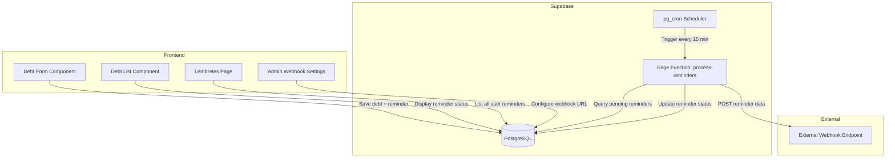

# Design Document: Debt Reminder Webhook

## Overview

This feature extends the existing debt management system with reminder capabilities and webhook integration. Users can configure reminders when creating or editing debts, specifying how many hours before the due date they want to be notified. A scheduled Supabase Edge Function processes pending reminders and sends data to a configurable webhook URL. Administrators can configure the webhook endpoint through a new admin settings page.

## Architecture



## Components and Interfaces

### Database Schema Changes

#### New Table: `debt_reminders`
```sql
CREATE TABLE public.debt_reminders (
  id UUID PRIMARY KEY DEFAULT gen_random_uuid(),
  divida_id UUID NOT NULL REFERENCES public.dividas(id) ON DELETE CASCADE,
  user_id UUID NOT NULL REFERENCES auth.users(id),
  reminder_hours INTEGER NOT NULL CHECK (reminder_hours > 0),
  trigger_at TIMESTAMP WITH TIME ZONE NOT NULL,
  status VARCHAR(20) NOT NULL DEFAULT 'pending' CHECK (status IN ('pending', 'sent', 'failed')),
  sent_at TIMESTAMP WITH TIME ZONE,
  error_message TEXT,
  created_at TIMESTAMP WITH TIME ZONE NOT NULL DEFAULT now(),
  updated_at TIMESTAMP WITH TIME ZONE NOT NULL DEFAULT now()
);
```

#### New Table: `system_settings`
```sql
CREATE TABLE public.system_settings (
  id UUID PRIMARY KEY DEFAULT gen_random_uuid(),
  key VARCHAR(100) NOT NULL UNIQUE,
  value TEXT,
  created_at TIMESTAMP WITH TIME ZONE NOT NULL DEFAULT now(),
  updated_at TIMESTAMP WITH TIME ZONE NOT NULL DEFAULT now()
);
```

### Frontend Components

#### 1. ReminderSelector Component
- Location: `src/domains/finance/components/ReminderSelector.tsx`
- Props: `{ value?: number; onChange: (hours: number | null) => void; disabled?: boolean }`
- Renders a select dropdown with options: None, 24h, 48h, 72h, 1 week (168h)

#### 2. ReminderStatusBadge Component
- Location: `src/domains/finance/components/ReminderStatusBadge.tsx`
- Props: `{ status: 'pending' | 'sent' | 'failed'; triggerAt?: string }`
- Displays colored badge indicating reminder status

#### 3. AdminWebhookSettings Page
- Location: `src/pages/AdminWebhookSettings.tsx`
- Admin-only page for configuring webhook URL
- Includes URL validation and test webhook button

#### 4. Lembretes (Reminders) Page
- Location: `src/pages/Lembretes.tsx`
- User-facing page listing all configured reminders
- Features:
  - Table/list view with debt info, reminder time, status
  - Status filter (all, pending, sent, failed)
  - Visual indicators for each status
  - Link to associated debt for quick navigation

### Hooks

#### 1. useDebtReminders Hook
- Location: `src/domains/finance/hooks/useDebtReminders.ts`
- Functions: `createReminder`, `updateReminder`, `deleteReminder`, `getReminderByDebtId`

#### 2. useWebhookSettings Hook
- Location: `src/domains/admin/hooks/useWebhookSettings.ts`
- Functions: `getWebhookUrl`, `saveWebhookUrl`, `testWebhook`

### Edge Function: process-reminders

- Location: `supabase/functions/process-reminders/index.ts`
- Triggered by pg_cron every 15 minutes
- Queries pending reminders where `trigger_at <= now()`
- For each reminder:
  1. Fetch debt and user data
  2. Build webhook payload
  3. POST to configured webhook URL
  4. Update reminder status based on response

## Data Models

### DebtReminder Interface
```typescript
interface DebtReminder {
  id: string;
  divida_id: string;
  user_id: string;
  reminder_hours: number;
  trigger_at: string;
  status: 'pending' | 'sent' | 'failed';
  sent_at?: string;
  error_message?: string;
  created_at: string;
  updated_at: string;
}
```

### WebhookPayload Interface
```typescript
interface WebhookPayload {
  event: 'debt_reminder';
  timestamp: string;
  user: {
    name: string;
    phone: string;
    email: string;
  };
  debt: {
    id: string;
    description: string;
    creditor: string;
    total_amount: number;
    remaining_amount: number;
    due_date: string;
    installments: number;
    installments_paid: number;
  };
  reminder: {
    id: string;
    hours_before: number;
    trigger_time: string;
  };
}
```

## Correctness Properties

*A property is a characteristic or behavior that should hold true across all valid executions of a system-essentially, a formal statement about what the system should do. Properties serve as the bridge between human-readable specifications and machine-verifiable correctness guarantees.*

### Property 1: Debt Reminder Persistence Round-Trip
*For any* debt with a valid reminder configuration (hours > 0), saving the debt with the reminder and then fetching it should return the same reminder hours value.
**Validates: Requirements 1.3**

### Property 2: URL Validation Correctness
*For any* string input, the URL validation function should return true only for strings that are valid HTTP/HTTPS URLs with proper format.
**Validates: Requirements 2.2**

### Property 3: Webhook Configuration Persistence Round-Trip
*For any* valid webhook URL, saving it to system settings and then fetching it should return the exact same URL string.
**Validates: Requirements 2.3**

### Property 4: Reminder Trigger Time Calculation
*For any* debt with a due date and reminder hours configuration, the calculated trigger time should equal (due_date - reminder_hours).
**Validates: Requirements 3.1**

### Property 5: Webhook Payload Completeness
*For any* debt and associated user, the generated webhook payload should contain all required fields: user name, user phone, debt description, debt creditor, debt total amount, debt remaining amount, and debt due date.
**Validates: Requirements 3.2**

### Property 6: Reminder Status Transition on Success
*For any* reminder that is successfully processed (webhook returns 2xx), the reminder status should transition from 'pending' to 'sent'.
**Validates: Requirements 4.1**

### Property 7: Pending Reminders Filter
*For any* list of reminders with mixed statuses, the processing function should only return reminders with status 'pending' and trigger_at <= current time.
**Validates: Requirements 4.2**

### Property 8: Reminder Reset on Update
*For any* reminder with status 'sent' or 'failed', updating the reminder_hours should reset the status to 'pending' and recalculate trigger_at.
**Validates: Requirements 4.3**

### Property 9: Reminders List Filter by Status
*For any* list of user reminders and a selected status filter, the filtered result should only contain reminders matching that status (or all reminders if filter is 'all').
**Validates: Requirements 5.5**

## Error Handling

### Frontend Errors
- Invalid URL format: Display inline validation error on webhook URL input
- Network errors when saving: Show toast notification with retry option
- Missing required fields: Prevent form submission with field-level errors

### Backend Errors
- Webhook timeout (>10s): Mark reminder as 'failed' with timeout error message
- Webhook non-2xx response: Mark reminder as 'failed' with HTTP status code
- Database errors: Log error and skip to next reminder, retry on next cron run
- Missing webhook URL: Log warning and skip all reminders (no failures marked)

### Retry Strategy
- Failed reminders are not automatically retried
- Users can manually reset reminder status through UI (future enhancement)
- Admins can view failed reminders in audit logs

## Testing Strategy

### Property-Based Testing
- Use `fast-check` library for property-based testing in TypeScript
- Each correctness property will have a corresponding property-based test
- Configure minimum 100 iterations per property test
- Tests will be tagged with format: `**Feature: debt-reminder-webhook, Property {number}: {property_text}**`

### Unit Tests
- URL validation function with edge cases (empty, malformed, valid HTTP/HTTPS)
- Trigger time calculation with various timezone scenarios
- Webhook payload builder with missing optional fields
- Reminder status state machine transitions

### Integration Tests
- End-to-end flow: Create debt with reminder → Verify reminder in database
- Admin webhook configuration save and retrieve
- Edge function processing with mocked webhook endpoint

