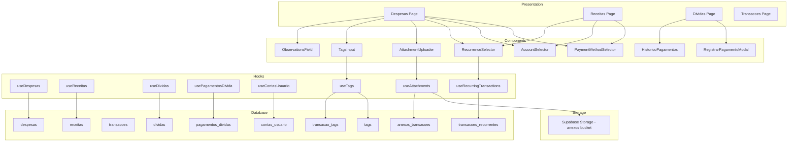

# Design Document: Payment Method Tracking & Financial Enhancements

## Overview

Esta feature adiciona melhorias abrangentes ao módulo financeiro do sistema Wallet:
- **Método de Pagamento**: PIX, Cartão, Boleto, Dinheiro, Transferência
- **Conta de Origem**: Rastreamento de contas e carteiras
- **Transações Recorrentes**: Automação de receitas e despesas periódicas
- **Anexos/Comprovantes**: Upload de imagens e PDFs
- **Tags Personalizadas**: Categorização flexível adicional
- **Notas/Observações**: Campo de texto livre
- **Histórico de Pagamentos**: Registro detalhado de pagamentos de dívidas

A implementação segue a arquitetura existente de 4 camadas (Presentation → Adapter/Hooks → Service → Infrastructure) e utiliza as tecnologias já estabelecidas no projeto.

## Architecture



## Components and Interfaces

### New Components

#### PaymentMethodSelector
Componente de seleção de método de pagamento reutilizável.

```typescript
interface PaymentMethodSelectorProps {
  value: PaymentMethod | null;
  onChange: (method: PaymentMethod | null) => void;
  disabled?: boolean;
  className?: string;
}

type PaymentMethod = 'pix' | 'cartao_credito' | 'cartao_debito' | 'boleto' | 'dinheiro' | 'transferencia';
```

#### AccountSelector
Componente de seleção de conta de origem.

```typescript
interface AccountSelectorProps {
  value: string | null;
  onChange: (accountId: string | null) => void;
  disabled?: boolean;
  allowCreate?: boolean;
  className?: string;
}
```

#### RegistrarPagamentoModal
Modal para registrar pagamentos de dívidas.

```typescript
interface RegistrarPagamentoModalProps {
  divida: Divida;
  open: boolean;
  onOpenChange: (open: boolean) => void;
  onSuccess?: () => void;
}
```

#### HistoricoPagamentos
Componente para exibir histórico de pagamentos de uma dívida.

```typescript
interface HistoricoPagamentosProps {
  dividaId: string;
  className?: string;
}
```

#### RecurrenceSelector
Componente para configurar recorrência de transações.

```typescript
interface RecurrenceSelectorProps {
  value: RecurrenceConfig | null;
  onChange: (config: RecurrenceConfig | null) => void;
  disabled?: boolean;
}

interface RecurrenceConfig {
  tipo: 'unica' | 'diaria' | 'semanal' | 'mensal' | 'anual';
  data_fim?: string;
}
```

#### AttachmentUploader
Componente para upload de anexos/comprovantes.

```typescript
interface AttachmentUploaderProps {
  transacaoId?: string;
  attachments: Attachment[];
  onUpload: (file: File) => Promise<void>;
  onDelete: (attachmentId: string) => Promise<void>;
  maxSize?: number; // default 5MB
  acceptedTypes?: string[]; // default ['image/jpeg', 'image/png', 'application/pdf']
}

interface Attachment {
  id: string;
  nome: string;
  url: string;
  tipo: string;
  tamanho: number;
  created_at: string;
}
```

#### TagsInput
Componente para entrada de tags personalizadas.

```typescript
interface TagsInputProps {
  value: string[];
  onChange: (tags: string[]) => void;
  suggestions?: string[];
  maxTags?: number;
  placeholder?: string;
}
```

#### ObservationsField
Campo de texto para observações com contador de caracteres.

```typescript
interface ObservationsFieldProps {
  value: string;
  onChange: (value: string) => void;
  maxLength?: number; // default 500
  placeholder?: string;
}
```

### Modified Interfaces

#### Despesa (updated)
```typescript
interface Despesa {
  id: string;
  user_id: string;
  descricao: string;
  valor: number;
  data: string;
  categoria_id?: string;
  metodo_pagamento?: PaymentMethod;
  conta_id?: string;
  observacoes?: string;
  recorrencia_id?: string;
  created_at: string;
  // Relations
  tags?: Tag[];
  anexos?: Attachment[];
}
```

#### Receita (updated)
```typescript
interface Receita {
  id: string;
  user_id: string;
  descricao: string;
  valor: number;
  data: string;
  categoria_id?: string;
  metodo_pagamento?: PaymentMethod;
  conta_id?: string;
  observacoes?: string;
  recorrencia_id?: string;
  created_at: string;
  // Relations
  tags?: Tag[];
  anexos?: Attachment[];
}
```

### New Interfaces

#### PagamentoDivida
```typescript
interface PagamentoDivida {
  id: string;
  divida_id: string;
  user_id: string;
  valor: number;
  data_pagamento: string;
  metodo_pagamento: PaymentMethod;
  conta_id?: string;
  observacoes?: string;
  created_at: string;
}
```

#### ContaUsuario
```typescript
interface ContaUsuario {
  id: string;
  user_id: string;
  nome: string;
  tipo: 'conta_corrente' | 'poupanca' | 'carteira' | 'cartao_credito' | 'outro';
  created_at: string;
}
```

#### Tag
```typescript
interface Tag {
  id: string;
  user_id: string;
  nome: string;
  cor?: string;
  created_at: string;
}
```

#### TransacaoRecorrente
```typescript
interface TransacaoRecorrente {
  id: string;
  user_id: string;
  tipo_transacao: 'receita' | 'despesa';
  descricao: string;
  valor: number;
  categoria_id?: string;
  metodo_pagamento?: PaymentMethod;
  conta_id?: string;
  recorrencia: 'diaria' | 'semanal' | 'mensal' | 'anual';
  dia_execucao?: number; // dia do mês para mensal
  dia_semana?: number; // 0-6 para semanal
  data_inicio: string;
  data_fim?: string;
  ativo: boolean;
  ultima_execucao?: string;
  created_at: string;
}
```

#### AnexoTransacao
```typescript
interface AnexoTransacao {
  id: string;
  transacao_tipo: 'receita' | 'despesa' | 'divida';
  transacao_id: string;
  user_id: string;
  nome: string;
  storage_path: string;
  tipo_arquivo: string;
  tamanho: number;
  created_at: string;
}
```

## Data Models

### Database Schema Changes

#### New Tables

```sql
-- Tabela de contas do usuário
CREATE TABLE public.contas_usuario (
  id UUID NOT NULL DEFAULT gen_random_uuid() PRIMARY KEY,
  user_id UUID NOT NULL REFERENCES auth.users(id) ON DELETE CASCADE,
  nome TEXT NOT NULL,
  tipo VARCHAR(20) NOT NULL CHECK (tipo IN ('conta_corrente', 'poupanca', 'carteira', 'cartao_credito', 'outro')),
  created_at TIMESTAMP WITH TIME ZONE NOT NULL DEFAULT now()
);

-- Tabela de pagamentos de dívidas
CREATE TABLE public.pagamentos_dividas (
  id UUID NOT NULL DEFAULT gen_random_uuid() PRIMARY KEY,
  divida_id UUID NOT NULL REFERENCES public.dividas(id) ON DELETE CASCADE,
  user_id UUID NOT NULL REFERENCES auth.users(id) ON DELETE CASCADE,
  valor DECIMAL(10,2) NOT NULL CHECK (valor > 0),
  data_pagamento DATE NOT NULL DEFAULT CURRENT_DATE,
  metodo_pagamento VARCHAR(20) NOT NULL CHECK (metodo_pagamento IN ('pix', 'cartao_credito', 'cartao_debito', 'boleto', 'dinheiro', 'transferencia')),
  conta_id UUID REFERENCES public.contas_usuario(id) ON DELETE SET NULL,
  observacoes TEXT,
  created_at TIMESTAMP WITH TIME ZONE NOT NULL DEFAULT now()
);

-- Tabela de tags
CREATE TABLE public.tags (
  id UUID NOT NULL DEFAULT gen_random_uuid() PRIMARY KEY,
  user_id UUID NOT NULL REFERENCES auth.users(id) ON DELETE CASCADE,
  nome TEXT NOT NULL,
  cor VARCHAR(7) DEFAULT '#6366F1',
  created_at TIMESTAMP WITH TIME ZONE NOT NULL DEFAULT now(),
  UNIQUE(user_id, nome)
);

-- Tabela de relacionamento transação-tags (para despesas)
CREATE TABLE public.despesa_tags (
  id UUID NOT NULL DEFAULT gen_random_uuid() PRIMARY KEY,
  despesa_id UUID NOT NULL REFERENCES public.despesas(id) ON DELETE CASCADE,
  tag_id UUID NOT NULL REFERENCES public.tags(id) ON DELETE CASCADE,
  UNIQUE(despesa_id, tag_id)
);

-- Tabela de relacionamento transação-tags (para receitas)
CREATE TABLE public.receita_tags (
  id UUID NOT NULL DEFAULT gen_random_uuid() PRIMARY KEY,
  receita_id UUID NOT NULL REFERENCES public.receitas(id) ON DELETE CASCADE,
  tag_id UUID NOT NULL REFERENCES public.tags(id) ON DELETE CASCADE,
  UNIQUE(receita_id, tag_id)
);

-- Tabela de anexos
CREATE TABLE public.anexos_transacoes (
  id UUID NOT NULL DEFAULT gen_random_uuid() PRIMARY KEY,
  user_id UUID NOT NULL REFERENCES auth.users(id) ON DELETE CASCADE,
  transacao_tipo VARCHAR(10) NOT NULL CHECK (transacao_tipo IN ('receita', 'despesa', 'divida')),
  transacao_id UUID NOT NULL,
  nome TEXT NOT NULL,
  storage_path TEXT NOT NULL,
  tipo_arquivo VARCHAR(50) NOT NULL,
  tamanho INTEGER NOT NULL CHECK (tamanho > 0 AND tamanho <= 5242880), -- max 5MB
  created_at TIMESTAMP WITH TIME ZONE NOT NULL DEFAULT now()
);

-- Tabela de transações recorrentes
CREATE TABLE public.transacoes_recorrentes (
  id UUID NOT NULL DEFAULT gen_random_uuid() PRIMARY KEY,
  user_id UUID NOT NULL REFERENCES auth.users(id) ON DELETE CASCADE,
  tipo_transacao VARCHAR(10) NOT NULL CHECK (tipo_transacao IN ('receita', 'despesa')),
  descricao TEXT NOT NULL,
  valor DECIMAL(10,2) NOT NULL CHECK (valor > 0),
  categoria_id UUID REFERENCES public.categorias(id) ON DELETE SET NULL,
  metodo_pagamento VARCHAR(20) CHECK (metodo_pagamento IN ('pix', 'cartao_credito', 'cartao_debito', 'boleto', 'dinheiro', 'transferencia')),
  conta_id UUID REFERENCES public.contas_usuario(id) ON DELETE SET NULL,
  recorrencia VARCHAR(10) NOT NULL CHECK (recorrencia IN ('diaria', 'semanal', 'mensal', 'anual')),
  dia_execucao INTEGER CHECK (dia_execucao >= 1 AND dia_execucao <= 31),
  dia_semana INTEGER CHECK (dia_semana >= 0 AND dia_semana <= 6),
  data_inicio DATE NOT NULL,
  data_fim DATE,
  ativo BOOLEAN NOT NULL DEFAULT true,
  ultima_execucao DATE,
  created_at TIMESTAMP WITH TIME ZONE NOT NULL DEFAULT now(),
  updated_at TIMESTAMP WITH TIME ZONE NOT NULL DEFAULT now()
);
```

#### Table Modifications

```sql
-- Adicionar campos às tabelas existentes
ALTER TABLE public.despesas 
  ADD COLUMN metodo_pagamento VARCHAR(20) CHECK (metodo_pagamento IN ('pix', 'cartao_credito', 'cartao_debito', 'boleto', 'dinheiro', 'transferencia')),
  ADD COLUMN conta_id UUID REFERENCES public.contas_usuario(id) ON DELETE SET NULL,
  ADD COLUMN observacoes TEXT CHECK (char_length(observacoes) <= 500),
  ADD COLUMN recorrencia_id UUID REFERENCES public.transacoes_recorrentes(id) ON DELETE SET NULL;

ALTER TABLE public.receitas 
  ADD COLUMN metodo_pagamento VARCHAR(20) CHECK (metodo_pagamento IN ('pix', 'cartao_credito', 'cartao_debito', 'boleto', 'dinheiro', 'transferencia')),
  ADD COLUMN conta_id UUID REFERENCES public.contas_usuario(id) ON DELETE SET NULL,
  ADD COLUMN observacoes TEXT CHECK (char_length(observacoes) <= 500),
  ADD COLUMN recorrencia_id UUID REFERENCES public.transacoes_recorrentes(id) ON DELETE SET NULL;

ALTER TABLE public.transacoes 
  ADD COLUMN metodo_pagamento VARCHAR(20) CHECK (metodo_pagamento IN ('pix', 'cartao_credito', 'cartao_debito', 'boleto', 'dinheiro', 'transferencia')),
  ADD COLUMN conta_id UUID REFERENCES public.contas_usuario(id) ON DELETE SET NULL,
  ADD COLUMN observacoes TEXT CHECK (char_length(observacoes) <= 500);
```

#### Supabase Storage Bucket

```sql
-- Criar bucket para anexos (via Supabase Dashboard ou API)
-- Nome: anexos-transacoes
-- Public: false
-- File size limit: 5MB
-- Allowed MIME types: image/jpeg, image/png, application/pdf
```

## Correctness Properties

*A property is a characteristic or behavior that should hold true across all valid executions of a system-essentially, a formal statement about what the system should do. Properties serve as the bridge between human-readable specifications and machine-verifiable correctness guarantees.*

### Property 1: Payment Method Filter Consistency
*For any* set of transactions and any payment method filter value, all transactions returned by the filter function should have a payment method equal to the filter value.
**Validates: Requirements 1.5**

### Property 2: Account Filter Consistency
*For any* set of transactions and any account filter value, all transactions returned by the filter function should have an account_id equal to the filter value.
**Validates: Requirements 2.4**

### Property 3: Debt Payment Balance Calculation
*For any* debt and any valid payment amount (where amount <= remaining balance), after registering the payment, the new paid amount should equal the previous paid amount plus the payment amount, and the new remaining balance should equal the total minus the new paid amount.
**Validates: Requirements 3.3**

### Property 4: Debt Payment Validation
*For any* debt and any payment amount that exceeds the remaining balance, the payment registration should be rejected with an error.
**Validates: Requirements 3.5**

### Property 5: Debt Status Auto-Update
*For any* debt where the remaining balance becomes zero after a payment, the debt status should automatically change to "quitada".
**Validates: Requirements 3.6**

### Property 6: Payment Method Statistics Consistency
*For any* set of expenses with payment methods, the sum of all payment method breakdowns should equal the total expenses amount.
**Validates: Requirements 4.1**

### Property 7: Optional Fields Persistence
*For any* transaction created without a payment method, account, or observations, the transaction should be saved successfully with those fields as null.
**Validates: Requirements 5.1, 6.3, 10.1**

### Property 8: Null Payment Method Filter
*For any* set of transactions, filtering for "não informado" should return exactly the transactions where payment method is null.
**Validates: Requirements 5.3**

### Property 9: Required Fields Validation for Debt Payments
*For any* debt payment registration attempt, if payment amount, payment date, or payment method is missing, the registration should be rejected.
**Validates: Requirements 3.2**

### Property 10: Recurring Transaction Generation
*For any* active recurring transaction configuration, when the scheduled date arrives, a new transaction instance should be created with the same attributes as the template.
**Validates: Requirements 7.3**

### Property 11: Attachment File Validation
*For any* file upload attempt, if the file type is not in the allowed list (JPG, PNG, PDF) or exceeds 5MB, the upload should be rejected with an appropriate error.
**Validates: Requirements 8.2, 8.3**

### Property 12: Tag Filter Consistency
*For any* set of transactions and any tag filter, all transactions returned should contain at least one of the filtered tags.
**Validates: Requirements 9.4**

### Property 13: Observations Character Limit
*For any* transaction with observations, the observations field should not exceed 500 characters.
**Validates: Requirements 10.4**

### Property 14: Search Includes Observations
*For any* search query and set of transactions, if a transaction's observations contain the search term, that transaction should be included in the results.
**Validates: Requirements 10.3**

### Property 15: Tag Suggestions Consistency
*For any* user typing a tag, the suggestions returned should only include tags that the user has previously created and that match the input prefix.
**Validates: Requirements 9.3**

## Error Handling

### Validation Errors
- Payment amount exceeds remaining balance: Display toast with message "O valor do pagamento não pode exceder o saldo restante"
- Missing required fields: Display inline validation errors on form fields
- Invalid payment method: Reject with validation error (should not happen with UI selector)
- File too large: Display toast with message "O arquivo excede o tamanho máximo de 5MB"
- Invalid file type: Display toast with message "Tipo de arquivo não permitido. Use JPG, PNG ou PDF"
- Observations too long: Prevent input and show character counter in red

### Database Errors
- Foreign key violations: Display generic error and log details
- Constraint violations: Display specific error message based on constraint
- Connection errors: Display retry option with toast notification
- Storage errors: Display toast with retry option for file uploads

### Optimistic Updates
- Use React Query's optimistic updates for payment registration
- Rollback on error with toast notification
- Invalidate related queries on success

## Testing Strategy

### Unit Testing
- Test PaymentMethodSelector renders all options correctly
- Test AccountSelector with and without custom account creation
- Test RegistrarPagamentoModal form validation
- Test payment calculation functions
- Test filter functions for payment method and account
- Test RecurrenceSelector configuration options
- Test AttachmentUploader file validation
- Test TagsInput autocomplete and creation
- Test ObservationsField character limit

### Property-Based Testing
Using **fast-check** library for property-based testing.

Each property test will:
- Generate random valid inputs using fast-check arbitraries
- Execute the function under test
- Verify the property holds for all generated inputs
- Run minimum 100 iterations per property

Property tests will be tagged with format: `**Feature: payment-method-tracking, Property {number}: {property_text}**`

### Integration Testing
- Test debt payment flow end-to-end
- Test transaction creation with payment method
- Test filter combinations
- Test statistics calculation with real data
- Test recurring transaction generation
- Test file upload and download flow
- Test tag creation and filtering

