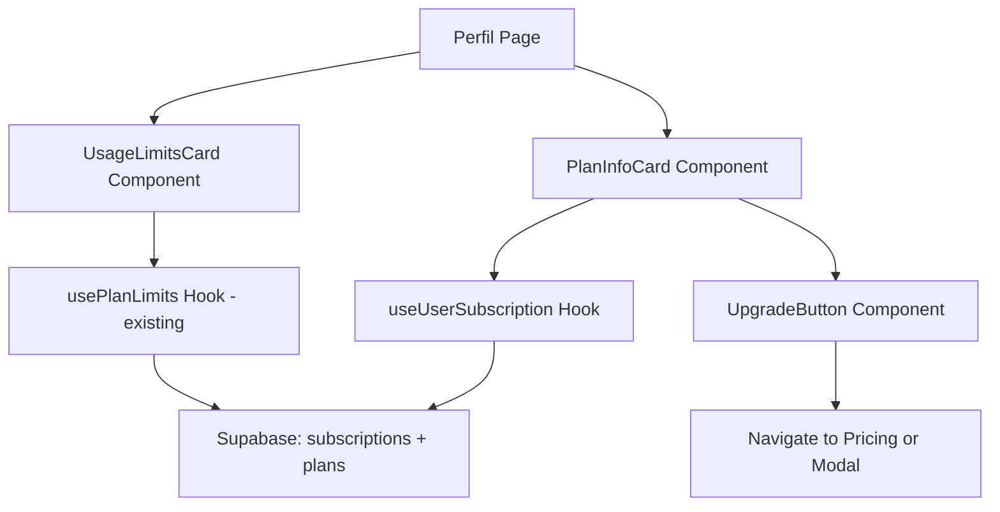

# Design Document: Profile Plan Upgrade

## Overview

Esta funcionalidade adiciona uma nova seção à página de Perfil (`/perfil`) que exibe informações sobre o plano atual do usuário, estatísticas de uso em relação aos limites do plano, e opções de upgrade. A implementação reutiliza o hook `usePlanLimits` existente e adiciona novos componentes para visualização.

## Architecture



A arquitetura segue o padrão existente do projeto:
- **Presentation Layer**: Novos componentes React (`PlanInfoCard`, `UsageLimitsCard`, `UsageProgressBar`)
- **Adapter Layer**: Hook `useUserSubscription` para dados de assinatura, reutilização de `usePlanLimits`
- **Infrastructure Layer**: Queries ao Supabase para `subscriptions`, `plans`, e `plan_limits`

## Components and Interfaces

### New Components

#### PlanInfoCard
Exibe informações do plano atual do usuário.

```typescript
interface PlanInfoCardProps {
  subscription: UserSubscription | null;
  plan: Plan | null;
  loading: boolean;
  error: Error | null;
  onUpgrade: () => void;
}
```

#### UsageLimitsCard
Exibe estatísticas de uso vs limites do plano.

```typescript
interface UsageLimitsCardProps {
  limits: Record<string, number | null>;
  usage: UsageStats;
  loading: boolean;
}
```

#### UsageProgressBar
Barra de progresso com indicadores de cor baseados no percentual.

```typescript
interface UsageProgressBarProps {
  current: number;
  limit: number | null;
  label: string;
}
```

### New Hook

#### useUserSubscription
Busca dados da assinatura e plano do usuário.

```typescript
interface UserSubscription {
  id: string;
  plan_id: string;
  status: string;
  expires_at: string | null;
  plan: {
    id: string;
    name: string;
    price: number;
    features: string[];
  };
}

interface UseUserSubscriptionReturn {
  subscription: UserSubscription | null;
  plan: Plan | null;
  loading: boolean;
  error: Error | null;
  isHighestTier: boolean;
  refetch: () => void;
}
```

## Data Models

### Existing Tables Used

```typescript
// plans table
interface Plan {
  id: string;
  name: string;
  price: number;
  features: string[] | null;
  created_at: string;
  updated_at: string;
}

// subscriptions table
interface Subscription {
  id: string;
  user_id: string;
  plan_id: string | null;
  status: string;
  expires_at: string | null;
  created_at: string;
  updated_at: string;
}

// plan_limits table (referenced in usePlanLimits)
interface PlanLimit {
  feature_key: string;
  limit_value: number | null;
}
```

### Feature Keys Mapping

```typescript
const FEATURE_LABELS: Record<string, string> = {
  transactions_this_month: "Transações por mês",
  custom_categories: "Categorias personalizadas",
  ai_analysis_this_month: "Análises de IA por mês",
  file_uploads_this_month: "Uploads por mês",
  vehicles: "Veículos",
  goals: "Metas",
  market_items: "Itens de mercado",
};
```

## Correctness Properties

*A property is a characteristic or behavior that should hold true across all valid executions of a system-essentially, a formal statement about what the system should do. Properties serve as the bridge between human-readable specifications and machine-verifiable correctness guarantees.*

### Property 1: Plan features display completeness
*For any* active subscription with a plan containing N features, the rendered PlanInfoCard should display exactly N feature items in the benefits list.
**Validates: Requirements 1.2**

### Property 2: Date formatting consistency
*For any* valid JavaScript Date object, the formatExpirationDate function should return a string in Portuguese format containing the month name and year.
**Validates: Requirements 1.3**

### Property 3: Usage stats display completeness
*For any* set of plan limits with K feature keys, the UsageLimitsCard should render exactly K usage items.
**Validates: Requirements 2.1**

### Property 4: Progress bar percentage calculation
*For any* usage value U and limit value L (where L > 0), the progress bar percentage should equal Math.min(100, (U / L) * 100).
**Validates: Requirements 2.2**

### Property 5: Progress bar color thresholds
*For any* usage percentage P:
- If P < 80, the progress bar should have the default color (green/blue)
- If 80 <= P < 100, the progress bar should have the warning color (yellow/orange)
- If P >= 100, the progress bar should have the danger color (red)
**Validates: Requirements 2.4, 2.5**

### Property 6: Upgrade button visibility
*For any* plan that is not the highest tier (determined by price or tier order), the upgrade button should be visible. For the highest tier plan, the button should be hidden and a "Plano Máximo" badge should be displayed.
**Validates: Requirements 3.1, 3.3**

### Property 7: Price difference calculation
*For any* current plan with price P1 and target plan with price P2, the displayed price difference should equal P2 - P1.
**Validates: Requirements 3.4**

### Property 8: Premium badge visibility
*For any* plan with price > 0 (non-free plan), a premium indicator badge should be displayed.
**Validates: Requirements 5.3**

## Error Handling

### Loading States
- Skeleton components exibidos durante carregamento inicial
- Componentes individuais podem ter estados de loading independentes

### Error States
- Mensagem de erro amigável com botão de retry
- Fallback para plano "Essencial" se não houver assinatura ativa
- Toast notification para erros de rede

### Edge Cases
- Usuário sem assinatura: exibir plano Essencial como padrão
- Limite null (ilimitado): exibir "Ilimitado" sem barra de progresso
- Assinatura expirada: exibir status e sugerir renovação

## Testing Strategy

### Property-Based Testing Library
Utilizaremos **fast-check** para testes de propriedade em TypeScript/JavaScript.

### Unit Tests
- Teste de renderização dos componentes com diferentes estados
- Teste de formatação de datas
- Teste de cálculo de percentuais
- Teste de lógica de cores do progress bar

### Property-Based Tests
Cada propriedade de corretude será implementada como um teste de propriedade separado usando fast-check:

1. **Property 1**: Gerar arrays de features aleatórios e verificar contagem de elementos renderizados
2. **Property 2**: Gerar datas aleatórias e verificar formato de saída
3. **Property 3**: Gerar objetos de limites aleatórios e verificar contagem de items
4. **Property 4**: Gerar pares (usage, limit) e verificar cálculo de percentual
5. **Property 5**: Gerar percentuais aleatórios e verificar classe de cor aplicada
6. **Property 6**: Gerar planos com diferentes preços e verificar visibilidade do botão
7. **Property 7**: Gerar pares de preços e verificar cálculo de diferença
8. **Property 8**: Gerar planos com diferentes preços e verificar visibilidade do badge

### Test Configuration
- Mínimo de 100 iterações por teste de propriedade
- Cada teste deve referenciar a propriedade do design: `**Feature: profile-plan-upgrade, Property {number}: {property_text}**`
