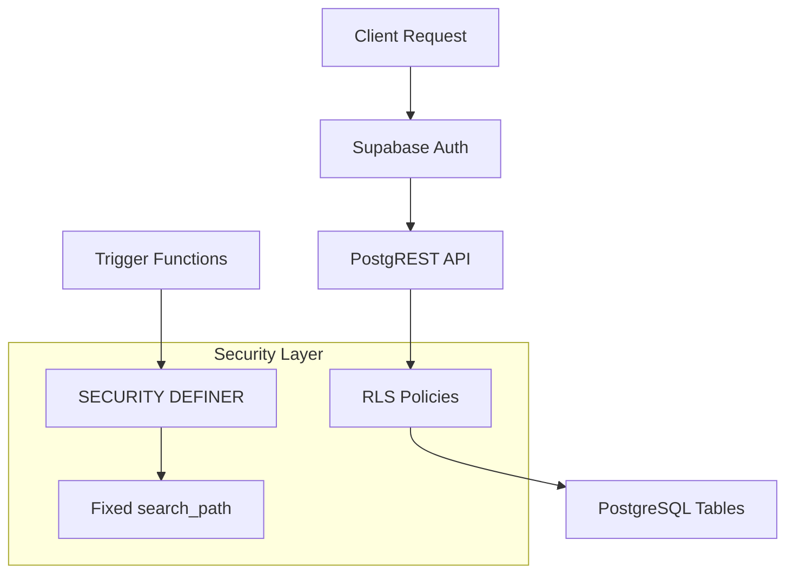

# Design Document: RLS Security Fixes

## Overview

This design addresses critical security vulnerabilities in the Supabase database configuration. The implementation will enable Row Level Security (RLS) on unprotected tables, add appropriate access policies, and fix function search paths to prevent SQL injection attacks.

## Architecture

The security fixes operate at the PostgreSQL database layer within Supabase:



### Security Model

1. **RLS Policies**: Control row-level access based on user role from `profiles.role`
2. **Function Security**: All functions use `SET search_path = public` to prevent schema injection
3. **Role-Based Access**: Admin-only tables restrict access via role check against `profiles` table

## Components and Interfaces

### 1. Admin Logs RLS Policies

| Policy | Operation | Access Rule |
|--------|-----------|-------------|
| `admin_logs_select_policy` | SELECT | Admin role only |
| `admin_logs_insert_policy` | INSERT | Denied (trigger-only) |

### 2. Plan Limits RLS Policies

| Policy | Operation | Access Rule |
|--------|-----------|-------------|
| `plan_limits_select_policy` | SELECT | All authenticated users |
| `plan_limits_admin_policy` | INSERT, UPDATE, DELETE | Admin role only |

### 3. Function Security Updates

All 9 functions will be recreated with `SET search_path = public`:

- `log_admin_action()`
- `cleanup_expired_tokens()`
- `update_payment_links_updated_at()`
- `update_updated_at_column()`
- `update_valor_restante()`
- `update_meta_status()`
- `update_item_status()`
- `calcular_proxima_manutencao()`
- `delete_user_account()`

## Data Models

### Helper Function for Role Check

```sql
CREATE OR REPLACE FUNCTION public.is_admin()
RETURNS boolean
LANGUAGE sql
SECURITY DEFINER
SET search_path = public
AS $$
  SELECT EXISTS (
    SELECT 1 FROM profiles
    WHERE user_id = auth.uid()
    AND role = 'admin'
  );
$$;
```

### RLS Policy Definitions

#### admin_logs

```sql
-- Enable RLS
ALTER TABLE public.admin_logs ENABLE ROW LEVEL SECURITY;

-- Admin-only SELECT
CREATE POLICY "admin_logs_select_policy" ON public.admin_logs
  FOR SELECT
  USING (public.is_admin());

-- No direct INSERT (handled by trigger)
CREATE POLICY "admin_logs_insert_policy" ON public.admin_logs
  FOR INSERT
  WITH CHECK (false);
```

#### plan_limits

```sql
-- Enable RLS
ALTER TABLE public.plan_limits ENABLE ROW LEVEL SECURITY;

-- All authenticated can SELECT
CREATE POLICY "plan_limits_select_policy" ON public.plan_limits
  FOR SELECT
  USING (auth.uid() IS NOT NULL);

-- Admin-only modifications
CREATE POLICY "plan_limits_admin_policy" ON public.plan_limits
  FOR ALL
  USING (public.is_admin())
  WITH CHECK (public.is_admin());
```

## Correctness Properties

*A property is a characteristic or behavior that should hold true across all valid executions of a system-essentially, a formal statement about what the system should do. Properties serve as the bridge between human-readable specifications and machine-verifiable correctness guarantees.*

### Property 1: Admin-only access to admin_logs
*For any* authenticated user querying admin_logs, the result set should be empty if and only if the user does not have admin role in their profile.
**Validates: Requirements 1.1, 1.2, 1.3**

### Property 2: Authenticated read access to plan_limits
*For any* authenticated user querying plan_limits, the result set should contain all plan limit records regardless of user role.
**Validates: Requirements 2.1, 2.2**

### Property 3: Admin-only write access to plan_limits
*For any* authenticated user attempting INSERT, UPDATE, or DELETE on plan_limits, the operation should succeed if and only if the user has admin role.
**Validates: Requirements 2.3, 2.4**

### Property 4: Function search_path immutability
*For any* of the 9 specified functions, the function definition should include `SET search_path = public` clause.
**Validates: Requirements 3.1-3.9**

## Error Handling

| Scenario | Error Response |
|----------|----------------|
| Non-admin SELECT on admin_logs | Empty result set (no error) |
| Non-admin INSERT on admin_logs | PostgreSQL policy violation error |
| Non-admin write on plan_limits | PostgreSQL policy violation error |
| Unauthenticated access | Supabase Auth 401 error |

## Testing Strategy

### Unit Testing

Unit tests will verify individual policy behaviors:
- Test admin_logs access with admin user
- Test admin_logs access with regular user
- Test plan_limits read access
- Test plan_limits write restrictions

### Property-Based Testing

Due to the nature of database security policies, property-based testing will use SQL queries to verify:
- Role-based access patterns across multiple test users
- Function definition inspection for search_path

**Testing Framework**: SQL-based tests executed via Supabase client

### Test Approach

1. **Setup**: Create test users with different roles
2. **Execution**: Run queries as different users via Supabase client
3. **Verification**: Assert expected row counts and error responses
4. **Cleanup**: Remove test data

### Migration Verification

After applying migrations:
```sql
-- Verify RLS is enabled
SELECT tablename, rowsecurity 
FROM pg_tables 
WHERE schemaname = 'public' 
AND tablename IN ('admin_logs', 'plan_limits');

-- Verify function search_path
SELECT proname, prosrc 
FROM pg_proc 
WHERE pronamespace = 'public'::regnamespace
AND proname IN ('log_admin_action', 'cleanup_expired_tokens', ...);
```
