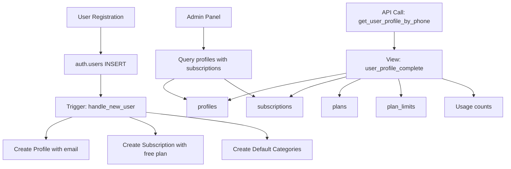

# Design Document: User Registration Sync

## Overview

Este documento descreve a solução técnica para corrigir o sistema de cadastro de usuários do Wallet. O problema principal é a falta de sincronização entre `auth.users`, `profiles` e `subscriptions`, resultando em dados incompletos e APIs quebradas.

A solução envolve:
1. Atualizar o trigger `handle_new_user` para copiar o email e criar subscription
2. Recriar a view `user_profile_complete` com todas as colunas necessárias
3. Corrigir a função `get_user_profile_by_phone`
4. Criar migration para corrigir dados existentes

## Architecture



## Components and Interfaces

### 1. Trigger: handle_new_user (Updated)

```sql
CREATE OR REPLACE FUNCTION public.handle_new_user()
RETURNS trigger
LANGUAGE plpgsql
SECURITY DEFINER
SET search_path TO 'public'
AS $function$
DECLARE
  free_plan_id UUID;
BEGIN
  -- Get the free plan ID (Essencial)
  SELECT id INTO free_plan_id FROM public.plans WHERE name = 'Essencial' LIMIT 1;
  
  -- Create profile with email from auth.users
  INSERT INTO public.profiles (user_id, name, organization_name, telefone, email)
  VALUES (
    NEW.id,
    COALESCE(NEW.raw_user_meta_data->>'name', ''),
    COALESCE(NEW.raw_user_meta_data->>'organization_name', ''),
    COALESCE(NEW.raw_user_meta_data->>'telefone', ''),
    NEW.email
  );
  
  -- Create subscription with free plan
  IF free_plan_id IS NOT NULL THEN
    INSERT INTO public.subscriptions (user_id, plan_id, status, expires_at)
    SELECT p.id, free_plan_id, 'active', NULL
    FROM public.profiles p
    WHERE p.user_id = NEW.id;
  END IF;
  
  -- Create default categories
  PERFORM public.create_default_categories(NEW.id);
  
  RETURN NEW;
END;
$function$;
```

### 2. View: user_profile_complete (Recreated)

A view será recriada com todas as colunas necessárias para a função RPC:

- Profile data: id, user_id, name, email, telefone, etc.
- Subscription data: id, status, expires_at, created_at
- Plan data: id, name, price, features, checkout_link
- Limits: transactions, categories, ai_analysis, file_uploads, vehicles, goals, market_items
- Usage counts: current month transactions, categories, vehicles, etc.
- Financial summary: total receitas, despesas, dividas

### 3. Function: get_user_profile_by_phone (Fixed)

A função será corrigida para usar os nomes de colunas corretos da view atualizada.

### 4. Migration: fix_existing_users

Migration para:
1. Atualizar profiles com email NULL para sincronizar de auth.users
2. Criar subscriptions para usuários sem uma

## Data Models

### profiles (existing, no changes)
| Column | Type | Description |
|--------|------|-------------|
| id | UUID | Primary key |
| user_id | UUID | FK to auth.users |
| name | TEXT | User name |
| email | TEXT | User email (synced from auth.users) |
| telefone | TEXT | Phone number |
| organization_name | TEXT | Organization name |
| role | TEXT | user or admin |
| avatar_url | TEXT | Avatar URL |
| created_at | TIMESTAMPTZ | Creation timestamp |
| updated_at | TIMESTAMPTZ | Update timestamp |

### subscriptions (existing, no changes)
| Column | Type | Description |
|--------|------|-------------|
| id | UUID | Primary key |
| user_id | UUID | FK to profiles.id |
| plan_id | UUID | FK to plans.id |
| status | TEXT | active, inactive, cancelled |
| expires_at | TIMESTAMPTZ | Expiration date (NULL = never) |
| created_at | TIMESTAMPTZ | Creation timestamp |

## Correctness Properties

*A property is a characteristic or behavior that should hold true across all valid executions of a system-essentially, a formal statement about what the system should do. Properties serve as the bridge between human-readable specifications and machine-verifiable correctness guarantees.*

### Property 1: Profile email sync
*For any* user in auth.users, the corresponding profile record SHALL have the same email value.
**Validates: Requirements 1.1, 1.3**

### Property 2: Subscription existence
*For any* profile record, there SHALL exist a corresponding subscription record with a valid plan_id.
**Validates: Requirements 1.2, 4.2**

### Property 3: RPC function completeness
*For any* valid phone number in profiles, calling get_user_profile_by_phone SHALL return a JSON object containing user, subscription, plan, limits, usage, limits_reached, and financial_summary keys.
**Validates: Requirements 2.1, 2.3**

### Property 4: View column completeness
*For any* query to user_profile_complete, the result SHALL contain all columns required by get_user_profile_by_phone function.
**Validates: Requirements 2.3**

### Property 5: Admin user list completeness
*For any* profile record, the admin users query SHALL return name, email, role, and plan_name (defaulting to 'Gratuito' if no subscription).
**Validates: Requirements 3.1, 3.2**

## Error Handling

1. **Trigger failures**: If profile creation fails, the transaction rolls back and user creation fails
2. **Missing free plan**: If Essencial plan doesn't exist, subscription is not created but profile is
3. **RPC with invalid phone**: Returns NULL without error
4. **Migration failures**: Each update is logged, failures don't stop the migration

## Testing Strategy

### Unit Tests
- Test trigger creates profile with all fields including email
- Test trigger creates subscription with free plan
- Test view returns all required columns
- Test RPC function returns correct structure

### Property-Based Tests
Using Vitest with fast-check for property-based testing:

1. **Property 1 (Email Sync)**: Generate random user data, create user, verify profile.email === auth.users.email
2. **Property 2 (Subscription Existence)**: For all profiles, verify subscription exists
3. **Property 3 (RPC Completeness)**: For all valid phone numbers, verify RPC returns complete structure
4. **Property 4 (View Columns)**: Query view metadata, verify all required columns exist
5. **Property 5 (Admin Query)**: For all profiles, verify admin query returns required fields

### Integration Tests
- End-to-end registration flow
- Admin panel user listing
- API call to get_user_profile_by_phone

### Test Configuration
- Property tests: minimum 100 iterations
- Each test tagged with property reference: `**Feature: user-registration-sync, Property N: description**`
