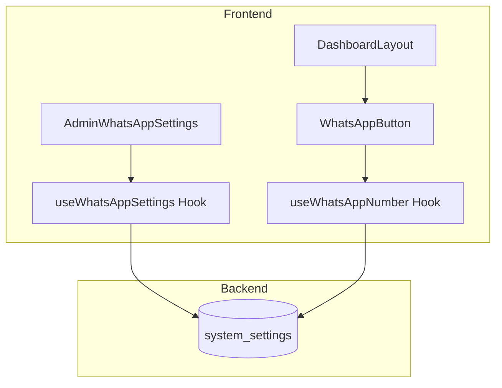

# Design Document: WhatsApp Wallet AI Button

## Overview

Esta funcionalidade adiciona um botão "Wallet AI" estilizado com ícone do WhatsApp no menu lateral do usuário, permitindo acesso rápido ao suporte via WhatsApp. O número é configurável pelo administrador através do painel admin, utilizando a tabela `system_settings` existente.

## Architecture



O fluxo segue a arquitetura existente:
1. **Admin**: Configura o número via `AdminWhatsAppSettings` → `useWhatsAppSettings` → `system_settings`
2. **User**: Visualiza o botão via `DashboardLayout` → `WhatsAppButton` → `useWhatsAppNumber` → `system_settings`

## Components and Interfaces

### WhatsAppButton Component

```typescript
// src/shared/components/WhatsAppButton.tsx
interface WhatsAppButtonProps {
  isCollapsed?: boolean;
  onClick?: () => void;
}

export const WhatsAppButton: React.FC<WhatsAppButtonProps>;
```

Responsabilidades:
- Renderizar botão com estilo verde (#25D366) e ícone WhatsApp
- Construir link wa.me/{numero}
- Ocultar-se quando número não configurado
- Adaptar-se ao estado collapsed do sidebar

### useWhatsAppNumber Hook (User)

```typescript
// src/shared/hooks/useWhatsAppNumber.ts
interface UseWhatsAppNumberReturn {
  whatsappNumber: string | null;
  whatsappUrl: string | null;
  loading: boolean;
}

export const useWhatsAppNumber: () => UseWhatsAppNumberReturn;
```

Responsabilidades:
- Buscar número do WhatsApp da tabela `system_settings`
- Construir URL formatada (wa.me/{numero})
- Cachear resultado com React Query

### useWhatsAppSettings Hook (Admin)

```typescript
// src/domains/admin/hooks/useWhatsAppSettings.ts
interface UseWhatsAppSettingsReturn {
  whatsappNumber: string | null;
  loading: boolean;
  saving: boolean;
  saveWhatsAppNumber: (number: string) => Promise<{ success: boolean; error?: string }>;
  isValidWhatsAppNumber: (number: string) => boolean;
}

export const useWhatsAppSettings: () => UseWhatsAppSettingsReturn;
```

Responsabilidades:
- CRUD do número na tabela `system_settings` (key: `whatsapp_number`)
- Validação do formato do número
- Feedback de sucesso/erro

### Validation Utility

```typescript
// src/domains/admin/utils/validation.ts (adicionar)
export const isValidWhatsAppNumber = (number: string): boolean;
export const sanitizeWhatsAppNumber = (number: string): string;
```

## Data Models

### System Settings Entry

```sql
-- Utiliza tabela existente: system_settings
-- Nova entrada:
INSERT INTO system_settings (key, value) VALUES ('whatsapp_number', NULL);
```

| Campo | Tipo | Descrição |
|-------|------|-----------|
| key | VARCHAR(100) | 'whatsapp_number' |
| value | TEXT | Número no formato internacional (ex: 5511999999999) |

### RLS Policy

A tabela `system_settings` já possui RLS configurado:
- **SELECT**: Apenas admins podem ler (via policy existente)
- **UPDATE**: Apenas admins podem atualizar

**Nota**: Para o botão do usuário funcionar, precisamos criar uma policy que permita SELECT público apenas para a key `whatsapp_number`.

```sql
-- Nova policy para leitura pública do número do WhatsApp
CREATE POLICY "Public can view whatsapp_number" 
ON public.system_settings 
FOR SELECT 
USING (key = 'whatsapp_number');
```

## Correctness Properties

*A property is a characteristic or behavior that should hold true across all valid executions of a system-essentially, a formal statement about what the system should do. Properties serve as the bridge between human-readable specifications and machine-verifiable correctness guarantees.*

### Property 1: WhatsApp URL Format Consistency
*For any* configured WhatsApp number, the generated URL SHALL always follow the format `https://wa.me/{sanitized_number}` where sanitized_number contains only digits.
**Validates: Requirements 1.2**

### Property 2: Invalid Number Rejection
*For any* string that contains non-digit characters (after sanitization) or has length outside 10-15 digits, the validation function SHALL return false.
**Validates: Requirements 2.3, 3.1, 3.2**

### Property 3: Number Sanitization Idempotence
*For any* valid phone number string, applying sanitization twice SHALL produce the same result as applying it once (idempotent operation).
**Validates: Requirements 3.1**

## Error Handling

| Cenário | Tratamento |
|---------|------------|
| Número não configurado | Botão não renderizado no menu |
| Erro ao buscar número | Log de erro, botão não renderizado |
| Número inválido no admin | Toast de erro, valor não salvo |
| Erro ao salvar | Toast de erro com mensagem específica |

## Testing Strategy

### Unit Tests
- Validação de formato de número (casos válidos e inválidos)
- Sanitização de número (remoção de caracteres especiais)
- Construção de URL do WhatsApp

### Property-Based Tests
Utilizando **fast-check** como biblioteca de property-based testing:

1. **Property 1**: Gerar números válidos aleatórios e verificar formato da URL
2. **Property 2**: Gerar strings aleatórias e verificar rejeição de inválidos
3. **Property 3**: Gerar números com formatação variada e verificar idempotência

Cada property-based test deve:
- Executar mínimo de 100 iterações
- Ser anotado com referência à propriedade do design document
- Formato: `**Feature: whatsapp-wallet-ai-button, Property {number}: {property_text}**`

### Integration Tests
- Fluxo completo de configuração pelo admin
- Renderização condicional do botão baseado na configuração
