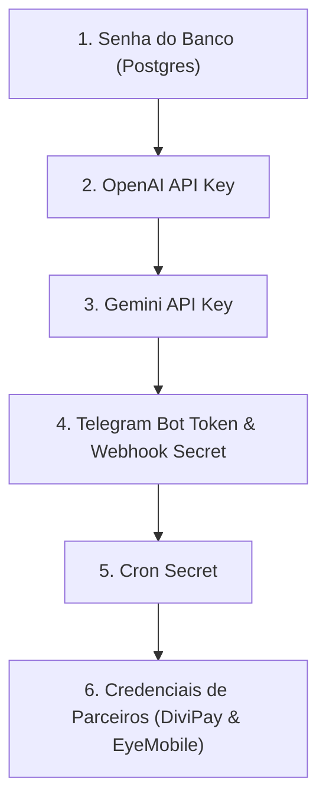

# PR #80 — Runbook Operacional de Implantação em Produção
## Hardening Integral de Segurança, RLS Vinculado a Sessão, Rate Limit Atômico e Enforcement da Fase C

> [!WARNING]
> **ESTE DOCUMENTO É UM RUNBOOK OPERACIONAL ESTRITO.**
> O PR #80 permanece em **DRAFT**. Nenhuma alteração em ambiente de produção, execução remota de migração ou rotação de credenciais deve ser realizada sem o seguimento metódico deste runbook durante a janela de implantação autorizada.

---

## 1. Estado Atual

* **Repositório:** `heitorfragavd-prog/wallet-App`
* **Pull Request:** `#80` (Status: `OPEN`, `isDraft: true`, `mergeable: MERGEABLE`)
* **Branch de Segurança:** `security/comprehensive-audit-hardening`
* **HEAD SHA Atual:** `a8db3e857ad23450c3e9451ecd007d4e6f933eef`
* **Base SHA Atual (`origin/develop`):** `f5293aa6638d5d838a981487afef09054d05aa3c` (integrando Fases 1 a 7, incluindo PR #87 / Fase 7 `f5293aa`)
* **Base SHA Histórica:** `8ae7c048bd325898d86445f7bf210f4fbf73c6e9`
* **Commit de Integração com develop:** `4a7e621` (Merge `--no-ff` de `origin/develop`, zero conflitos textuais)

---

## 2. Escopo da Implantação

A implantação do PR #80 resolve um conjunto crítico de vulnerabilidades identificadas na auditoria de segurança da Wallet App, sem quebrar a operação nem regredir as entregas funcionais de produtos (Fases 1 a 7):

1. **Investimentos:** Eliminação do bypass de senha via API direta através de RLS de banco atômico vinculado a sessão ativa (`is_investimentos_unlocked(auth.uid())`).
2. **Rate Limit e Força Bruta:** Rate limit atômico compartilhado via Postgres (`rate_limits` e RPC `check_rate_limit`) em transação única com bloqueio de linha.
3. **Isolamento de Credenciais:** Revogação de permissão `SELECT` em colunas que armazenam segredos (`divipay_config.client_secret`, `eyemobile_config.secret_key`, `senha_investimentos.senha_hash`) para a role `authenticated`.
4. **Proteção contra Auto-Elevação de Privilégios:** Triggers de banco (`protect_profiles_role`, `enforce_profiles_role_insert`) e revogação de `UPDATE` na coluna `profiles.role` para usuários comuns.
5. **SSRF em Webhooks e Proxies:** Validação estrita de IPs/DNS contra redes privadas, loopback e metadados de nuvem (`ssrf-validator.ts`).
6. **XSS em Recibos:** Sanitização de HTML e sandbox estrito de iframe no frontend.
7. **IA e Reservas de Tokens:** Idempotência e proteção contra virada de janela em consumo de LLM (`reserve_ai_tokens`, `reconcile_ai_tokens`).

---

## 3. Inventário Real do Banco de Dados

### 3.1 Arquivos de Migração e Scripts do PR #80
* `supabase/migrations/20260908120000_security_phase_a_infrastructure.sql` (Fase A: Infraestrutura e RPCs seguras, permissivo — executável via psql ou SQL Editor)
* `supabase/migrations/20260908120001_security_phase_c_enforcement.sql` (Fase C: Revogação de colunas e ativação do RLS estrito — chamada internamente pelo script orquestrador)
* `scripts/apply-phase-c-enforcement.sql` (Procedimento oficial transacional da Fase C com gating e registro em histórico — **OBRIGATORIAMENTE EXECUTADO VIA PSQL**, não suportado no SQL Editor do navegador)
* `supabase/ops/rollback_20260908120000_safe_recovery.sql` (Procedimento oficial de contingência segura para a Fase C — via psql)

### 3.2 Tabela de Inventário de Objetos do Banco

| Objeto | Tipo | Estado Anterior | Estado após PR #80 | Risco Mitigado | Estratégia de Rollback |
| :--- | :--- | :--- | :--- | :--- | :--- |
| `public.rate_limits` | Tabela | Inexistente | Criada (PK: `bucket_key`, contador, janela, timestamp). Acesso restrito a `service_role`. | Race condition e brute-force em autenticação e APIs. | `DROP TABLE IF EXISTS public.rate_limits CASCADE;` |
| `public.investimentos_sessions` | Tabela | Inexistente | Criada (PK: `session_id`, FK: `auth.users`, `expires_at`). Acesso restrito a `service_role`. | Sessões órfãs e bypass de senha de investimentos. | `DROP TABLE IF EXISTS public.investimentos_sessions CASCADE;` |
| `public.ai_token_reservations` | Tabela | Inexistente | Criada (PK: `reservation_id`, tracking de status e janela). Acesso restrito a `service_role`. | Estorno indevido e saldo inflado em virada de janela de IA. | `DROP TABLE IF EXISTS public.ai_token_reservations CASCADE;` |
| `public.check_rate_limit` | RPC / Função | Inexistente | Criada (SECURITY DEFINER, `FOR UPDATE` em linha). Executável apenas por `service_role`. | Burlar rate limit por concorrência de requisições. | `DROP FUNCTION IF EXISTS public.check_rate_limit;` |
| `public.get_divipay_config_status` | RPC / Função | Inexistente | Criada (SECURITY DEFINER, retorna `has_secret` booleano). Executável por `authenticated`. | Exposição de `client_secret` e `access_token` no frontend. | `DROP FUNCTION IF EXISTS public.get_divipay_config_status;` |
| `public.get_eyemobile_config_status` | RPC / Função | Inexistente | Criada (SECURITY DEFINER, retorna `has_secret` booleano). Executável por `authenticated`. | Exposição de `secret_key` no frontend. | `DROP FUNCTION IF EXISTS public.get_eyemobile_config_status;` |
| `public.has_senha_investimentos` | RPC / Função | Inexistente | Criada (SECURITY DEFINER, retorna booleano se usuário tem senha). Executável por `authenticated`. | Necessidade de SELECT direto em `senha_investimentos`. | `DROP FUNCTION IF EXISTS public.has_senha_investimentos;` |
| `public.registrar_falha_senha_investimentos` | RPC / Função | Inexistente | Criada (SECURITY DEFINER, bloqueio progressivo atômico). Executável apenas por `service_role`. | Brute-force em senhas de investimentos via concorrência. | `DROP FUNCTION IF EXISTS public.registrar_falha_senha_investimentos;` |
| `public.desbloquear_sessao_investimentos` | RPC / Função | Inexistente | Criada (SECURITY DEFINER, atômica, registra sessão). Executável apenas por `service_role`. | Abertura de sessão de investimentos com senha antiga/inválida. | `DROP FUNCTION IF EXISTS public.desbloquear_sessao_investimentos;` |
| `public.is_investimentos_unlocked` | Função STABLE | Inexistente | Criada (SECURITY DEFINER, lê JWT claim `session_id`/`jti` e valida sessão ativa). Executável por `authenticated` e `service_role`. | Acesso a tabelas de investimentos sem sessão ativa comprovada no banco. | `DROP FUNCTION IF EXISTS public.is_investimentos_unlocked;` |
| `public.reserve_ai_tokens` | RPC / Função | Inexistente | Criada (SECURITY DEFINER, reserva atômica de janela). Executável por `service_role`. | Consumo excessivo de tokens LLM. | `DROP FUNCTION IF EXISTS public.reserve_ai_tokens;` |
| `public.reconcile_ai_tokens` | RPC / Função | Inexistente | Criada (SECURITY DEFINER, reconciliação com proteção de virada de janela). Executável por `service_role`. | Desbalanceamento de rate limit na virada de hora. | `DROP FUNCTION IF EXISTS public.reconcile_ai_tokens;` |
| `trg_protect_profiles_role` em `public.profiles` | Trigger / Função | Inexistente | Blindagem BEFORE UPDATE impedindo alteração da coluna `role` exceto por `service_role` ou admin verificado. | Auto-elevação de usuário comum para `admin`. | `DROP TRIGGER IF EXISTS trg_protect_profiles_role ON public.profiles;` |
| `trg_enforce_profiles_role_insert` em `public.profiles` | Trigger / Função | Inexistente | Blindagem BEFORE INSERT forçando `role = 'user'` se não for admin/service_role. | Cadastro direto com perfil de `admin`. | `DROP TRIGGER IF EXISTS trg_enforce_profiles_role_insert ON public.profiles;` |
| `public.divipay_config` (permissões de coluna) | Tabela / Colunas | `SELECT *` permitido para `authenticated` | `REVOKE SELECT` geral; `GRANT SELECT` apenas em colunas não-sensíveis (`id`, `user_id`, `client_id`, `environment`, `is_active`, `webhook_url`, `token_expires_at`, `created_at`, `updated_at`). | Vazamento de `client_secret` e `access_token` por query direta via PostgREST. | Safe Contingency Forward via `rollback_20260908120000_safe_recovery.sql`. |
| `public.eyemobile_config` (permissões de coluna) | Tabela / Colunas | `SELECT *` permitido para `authenticated` | `REVOKE SELECT` geral; `GRANT SELECT` apenas em colunas seguras (exclui `secret_key`). | Vazamento de `secret_key` Eyemobile. | Safe Contingency Forward via `rollback_20260908120000_safe_recovery.sql`. |
| `public.senha_investimentos` (permissões de tabela) | Tabela | Acesso direto via RLS básico | `REVOKE ALL` para `authenticated`, `anon`, `PUBLIC`. `GRANT ALL` apenas para `service_role`. | Vazamento de hash de senha e tentativas restantes por API direta. | Safe Contingency Forward via `rollback_20260908120000_safe_recovery.sql`. |
| `public.profiles` (permissões de coluna) | Tabela / Colunas | `UPDATE *` permitido para `authenticated` | `REVOKE UPDATE`; `GRANT UPDATE` apenas em `(name, organization_name, telefone, updated_at)`. | Bypass de trigger via SQL UPDATE direto de role. | Safe Contingency Forward via `rollback_20260908120000_safe_recovery.sql`. |
| Policies em `investimentos`, `depositos_investimentos`, `metas_investimento`, `historico_rendimentos`, `proventos_esperados`, `configuracoes_investimentos` | RLS Policies | `(auth.uid() = user_id)` simples | `(auth.uid() = user_id AND public.is_investimentos_unlocked(auth.uid()))` estrito. | Acesso a saldo e ativos de investimentos sem passar pelo fluxo de validação de senha. | Safe Contingency Forward via `rollback_20260908120000_safe_recovery.sql`. |

---

## 4. Mapeamento de Edge Functions

| Edge Function | Mudança no PR #80 | Auth | Secrets Utilizados | Dependências | Smoke Test | Rollback |
| :--- | :--- | :--- | :--- | :--- | :--- | :--- |
| **`validar-senha`** | Implementação de rate limit atômico via `check_rate_limit`, desbloqueio transacional de sessão via `desbloquear_sessao_investimentos`, migração de hashes legados para Argon2id/crypto seguro. | Sessão JWT do usuário + validação interna de `user_id`. | `SUPABASE_URL`, `SUPABASE_SERVICE_ROLE_KEY` | `rate_limits`, `senha_investimentos`, `investimentos_sessions` | POST com senha correta retorna `token` e desbloqueia; 3 tentativas erradas bloqueia por 30m. | Redeploy do commit anterior via Supabase CLI. |
| **`eyemobile-sync`** | Endurecimento da autenticação: eliminação de bypass de `service_role` via cabeçalho decodificado manualmente (`atob`), validação de tenant (`workspace_id`), leitura de credenciais via `service_role` server-side. Integrado com preflight canônico de produto (Fase 3). | Bearer JWT ou token de serviço verificado no Supabase Auth. | `SUPABASE_URL`, `SUPABASE_SERVICE_ROLE_KEY` | `eyemobile_config`, `produtos_eyemobile`, `workspaces` | POST de teste de conexão ou sincronização de vendas; tentativa cross-tenant retorna 403. | Redeploy do commit anterior via Supabase CLI. |
| **`telegram-webhook`** | Mitigação de IDOR no fluxo `action: "vincular"`, restrição de rotas administrativas com `isServiceRole`, validação do header `X-Telegram-Bot-Api-Secret-Token`. Integrado com confirmação de NF anti-TOCTOU (Fase 4). | Webhook secret header do Telegram (`TELEGRAM_WEBHOOK_SECRET`) + validação de usuário. | `SUPABASE_URL`, `SUPABASE_SERVICE_ROLE_KEY`, `TELEGRAM_BOT_TOKEN`, `TELEGRAM_WEBHOOK_SECRET`, `OPENAI_API_KEY`, `GEMINI_API_KEY` | `telegram_chats`, `notas_fiscais_compra`, `nf_itens`, RPC `aplicar_item_nf_estoque_custo` | POST de webhook simulado com comando `/start` ou confirmação de NF via inline keyboard. | Redeploy do commit anterior via Supabase CLI. |
| **`openai-proxy`** | Validação de workspace (`validateUserWorkspace`), validação de SSRF para URLs customizadas de endpoint (`validateSafeUrl`), controle de rate limit compartilhado com reservas de token duráveis. | Bearer JWT do usuário autenticado no workspace. | `SUPABASE_URL`, `SUPABASE_SERVICE_ROLE_KEY`, `OPENAI_API_KEY` | `workspaces`, `ia_configuracoes`, `rate_limits`, `ai_token_reservations` | POST com prompt financeiro válido retorna streaming/json; requisição para IP privado retorna erro SSRF 400. | Redeploy do commit anterior via Supabase CLI. |
| **`divipay-api`** | Leitura de credenciais server-side via `service_role` (frontend nunca recebe o client_secret), proteção SSRF em webhooks configurados, validação de token OAuth com refresh seguro. | Bearer JWT do usuário autenticado. | `SUPABASE_URL`, `SUPABASE_SERVICE_ROLE_KEY` | `divipay_config` | Invocação de `getBalance` ou `configureWebhook`; tentativa com token inválido força refresh sem expor secret. | Redeploy do commit anterior via Supabase CLI. |
| **`divipay-webhook`** | Validação de assinatura do webhook Divipay, prevenção de SSRF na URL de notificação. | Assinatura no header de webhook. | `SUPABASE_URL`, `SUPABASE_SERVICE_ROLE_KEY` | `divipay_config`, `divipay_transacoes` | POST de evento de pagamento sintético no webhook; rejeita payloads com assinatura inválida. | Redeploy do commit anterior via Supabase CLI. |
| **`ia-deposito`** | Autenticação por JWT, rate limit compartilhado, resolução de chaves OpenAI no servidor. | Bearer JWT do usuário. | `SUPABASE_URL`, `SUPABASE_SERVICE_ROLE_KEY`, `OPENAI_API_KEY` | `ia_configuracoes`, `rate_limits` | Invocação para classificar depósito com payload válido; responde sem expor chave. | Redeploy do commit anterior via Supabase CLI. |
| **`categorizar-ia`** | Autenticação por JWT, rate limit compartilhado e sanitização de dados financeiros. | Bearer JWT do usuário. | `SUPABASE_URL`, `SUPABASE_SERVICE_ROLE_KEY`, `OPENAI_API_KEY` | `ia_configuracoes`, `rate_limits` | Invocação para categorizar transação; responde com categoria válida. | Redeploy do commit anterior via Supabase CLI. |
| **`cron-alertas-investimentos`** | Autenticação restrita a chamadas agendadas via `CRON_SECRET` ou `service_role`. | Header de autenticação de cron (`CRON_SECRET`). | `SUPABASE_URL`, `SUPABASE_SERVICE_ROLE_KEY`, `CRON_SECRET` | `investimentos`, `metas_investimento` | Invocação com header de cron correto executa; sem header retorna 401. | Redeploy do commit anterior via Supabase CLI. |
| **`gerar-recibo`** | Sanitização rigorosa de entradas de texto contra XSS (`escapeHtml`) e geração de documento HTML limpo. | Bearer JWT do usuário autenticado. | `SUPABASE_URL`, `SUPABASE_SERVICE_ROLE_KEY` | Nenhuma tabela direta | POST com payload contendo `<script>` retorna HTML sanitizado (`&lt;script&gt;`). | Redeploy do commit anterior via Supabase CLI. |
| **`sefaz-sync`** | Autenticação restrita via `CRON_SECRET` ou `service_role`, envio seguro de alertas no Telegram. | Header de autenticação de cron (`CRON_SECRET`). | `SUPABASE_URL`, `SUPABASE_SERVICE_ROLE_KEY`, `CRON_SECRET`, `TELEGRAM_BOT_TOKEN` | `notas_fiscais_compra` | Invocação com `CRON_SECRET` válido processa notas; sem header retorna 401. | Redeploy do commit anterior via Supabase CLI. |
| **`test-webhook`** | Validador de endpoints de teste com bloqueio estrito de SSRF (rejeita 127.0.0.1, RFC 1918 e metadados). | Bearer JWT do usuário. | `SUPABASE_URL`, `SUPABASE_SERVICE_ROLE_KEY` | Nenhuma tabela | POST testando URL `http://169.254.169.254` retorna erro imediato de SSRF bloqueado. | Redeploy do commit anterior via Supabase CLI. |
| **`wallet-ai-orchestrator`** | Validação de JWT e workspace, orquestração de ferramentas financeiras, rate limit durável. | Bearer JWT do usuário no workspace. | `SUPABASE_URL`, `SUPABASE_SERVICE_ROLE_KEY`, `OPENAI_API_KEY`, `GEMINI_API_KEY` | `workspaces`, `rate_limits`, `ai_token_reservations` | Pergunta contextual via orchestrator; responde com roteamento correto. | Redeploy do commit anterior via Supabase CLI. |

---

## 5. Mapeamento do Frontend e Desacoplamento de Secrets

### 5.1 Arquivos do Frontend Alterados no PR #80
1. `src/domains/auth/hooks/useProfile.ts`:
   * Trata de forma defensiva discrepâncias de schema (`PGRST204` / `42703`), garantindo fallback caso colunas ausentes sejam consultadas durante o rollout.
   * Não realiza mais tentativa de mutação no campo `role`.
2. `src/domains/admin/hooks/useEyemobileConfig.ts`:
   * Não executa mais `SELECT secret_key`. Consulta exclusivamente a lista de colunas públicas/operacionais.
   * Obtém a existência de segredo (`has_secret: boolean`) através da RPC `get_eyemobile_config_status()`.
   * Salva a `secret_key` via `UPDATE` (permitido por `GRANT UPDATE`), mas nunca tenta reler o segredo do banco.
3. `src/domains/divipay/services/DivipayService.ts`:
   * Exclui expressamente `client_secret` e `access_token` das queries (`select(safeColumns)`).
   * Atribui `client_secret: null` e `access_token: null` em memória local.
   * Delega operações de saldo, Pix e extrato para a Edge Function `divipay-api` via server-side client.
4. `src/domains/finance/hooks/useSenhaInvestimentos.ts`:
   * Substituiu qualquer acesso direto à tabela `senha_investimentos` pela RPC `has_senha_investimentos()`.
   * Delega autenticação e alteração de senha à Edge Function `validar-senha`, que cria a sessão em `investimentos_sessions`.
5. `src/pages/Recibos.tsx`:
   * Visualização de recibos em iframe com sandbox restritivo (`sandbox="allow-modals allow-same-origin"` sem `allow-scripts`), impedindo execução de scripts mesmo perante eventuais injeções.

### 5.2 Comprovação de Desacoplamento
O frontend foi completamente auditado e não depende mais de privilégios de leitura em colunas confidenciais. Na Fase C, quando `REVOKE SELECT` for aplicado sobre `client_secret`, `secret_key` e `senha_hash`, **nenhuma chamada do frontend falhará**, pois todos os componentes foram adaptados para utilizar as RPCs de status booleanas e as Edge Functions intermediárias.

---

## 6. Modelo de Credenciais do Supabase e Estratégia de API Keys

### 6.1 Distinções Arquiteturais Fundamentais no Supabase

| Conceito | Tipo de Token / Chave | Onde é Enviada | Comportamento de Verificação | Impacto ao Rotacionar |
| :--- | :--- | :--- | :--- | :--- |
| **Legacy `anon` Key** | JWT assinado com JWT Secret legado (`role: 'anon'`) | Header `apikey` ou `Authorization: Bearer` | Validado via assinatura HMAC-SHA256 do JWT Secret | Muda a chave anônima do frontend (exige novo build). |
| **Legacy `service_role` Key** | JWT assinado com JWT Secret legado (`role: 'service_role'`) | Header `apikey` ou `Authorization: Bearer` | Validado via assinatura do JWT Secret; bypassa RLS no PostgREST | Quebra todas as Edge Functions se a nova chave não for propagada antes. |
| **Nova Secret API Key (`sb_secret_...`)** | Chave opaca de alta entropia | Header `apikey` (Gateway) | Validada no API Gateway do Supabase; **NÃO É JWT** | Não afeta sessões de usuários; permite múltiplas chaves ativas simultaneamente. |
| **Nova Publishable API Key (`sb_publishable_...`)** | Chave opaca pública | Header `apikey` (Gateway) | Validada no API Gateway do Supabase; substitui o anon legado | Não afeta sessões de usuários; substituição suave. |
| **Legacy JWT Signing Secret** | Segredo simétrico (HMAC-SHA256) | Interno do Supabase Auth (GoTrue) e PostgREST | Assina e valida **todos** os JWTs de usuários, refresh tokens, anon e service_role | **CRÍTICO:** Invalida instantaneamente **todas** as sessões ativas de usuários, todos os refresh tokens e regenera anon/service_role! |
| **Novo Sistema de JWT Signing Keys** | Par de chaves assimétricas (ECDSA/EdDSA) | Supabase Auth com JWKS endpoint | Suporta rotação suave sem derrubar sessões ativas | Rotação sem impacto em sessões ativas. |

### 6.2 Auditoria do Código Real: Consumo de `SUPABASE_SERVICE_ROLE_KEY` e Autenticação Entre Serviços

A auditoria estrita do código-fonte comprovou que:
1. **Zero Uso do Novo Modelo:** O repositório **NÃO possui nenhuma ocorrência** de `SUPABASE_SECRET_KEYS` ou `SUPABASE_PUBLISHABLE_KEYS`.
2. **Cliente PostgREST Server-Side:** Todas as 13 Edge Functions instanciam o cliente administrativo através de:
   ```typescript
   createClient(supabaseUrl, Deno.env.get("SUPABASE_SERVICE_ROLE_KEY")!)
   ```
3. **Autenticação Inter-Serviços por Comparação Estrita de Chave:** Em 4 Edge Functions críticas, o código realiza verificação manual de igualdade de strings com a variável de ambiente:
   * `supabase/functions/telegram-webhook/index.ts:766`: `const isServiceRole = Boolean(supabaseServiceKey && token === supabaseServiceKey);`
   * `supabase/functions/openai-proxy/index.ts:1191`: `const isServiceRoleCall = Boolean(supabaseServiceKey && jwt === supabaseServiceKey && body.user_id);`
   * `supabase/functions/divipay-api/index.ts:209`: `const isServiceRole = Boolean(serviceRoleKey && token === serviceRoleKey);`
   * `supabase/functions/eyemobile-sync/index.ts:180`: `const isServiceRole = Boolean(serviceRoleKey && token === serviceRoleKey);`
4. **Enforcement em Testes Unitários:** A suíte de testes `src/core/security/edge-functions-auth.test.ts` (linhas 26, 41, 51) valida expressamente a presença dessa comparação de igualdade estrita:
   ```typescript
   expect(content).toMatch(/serviceRoleKey\s*&&\s*token\s*===\s*serviceRoleKey/);
   expect(content).toMatch(/supabaseServiceKey\s*&&\s*jwt\s*===\s*supabaseServiceKey/);
   expect(content).toMatch(/token\s*===\s*supabaseServiceKey/);
   ```

> [!DANGER]
> **INCOMPATIBILIDADE IMEDIATA COM `sb_secret_...`:**
> Se um operador injetar uma nova Secret API Key (`sb_secret_...`) na variável `SUPABASE_SERVICE_ROLE_KEY`, ou tentar passá-la como `Authorization: Bearer <sb_secret>`, ocorrerão duas falhas graves imediatas:
> 1. As Secret API Keys são chaves opacas e **não contêm claims JWT**; chamadas que dependem de inspeção de payload ou de validação JWT falharão.
> 2. Chamadas inter-serviços que esperam o JWT de service_role padrão para a verificação `token === supabaseServiceKey` falharão caso o chamador envie formato diferente daquele esperado em runtime.
> 3. Migrar toda a arquitetura para `SUPABASE_SECRET_KEYS` exige refatorar múltiplos consumidores, chamadores de cron, testes e adaptadores de autenticação.

### 6.3 Auditoria no Histórico Git: Exposição de `service_role` e `JWT Secret`

Foi realizada uma auditoria criptográfica completa em todo o histórico de commits do Git:
* `git log -p -S "SUPABASE_SERVICE_ROLE_KEY"`: Todos os commits no histórico utilizam exclusivamente referências a variáveis de ambiente (`Deno.env.get` ou `process.env`). **Zero chaves reais atribuídas.**
* `git log -p -G "eyJhbGci"`: Foram localizadas 16 ocorrências no histórico, todas categorizadas como:
  * Mocks sintéticos de teste com assinaturas propositalmente falsas (`eyemobile-sync-product-identity.test.ts`), criados para validar que o sistema rejeita JWTs forjados.
  * Chaves públicas de demo (`iss: supabase-demo`) em workflows de containers CI locais.
  * Placeholders documentais (`your-anon-key-here`).
* `git log -S "JWT_SECRET"`: **Zero ocorrências no histórico.**
* `.env` / Arquivos de ambiente: Apenas `.env.example` com valores mock (`your_pluggy_client_secret_here`, etc.) foi commitado.

**Classificação Oficial de Exposição:**
> ### `SERVICE_ROLE_EXPOSURE_NOT_CONFIRMED`
> Não há nenhuma evidência de que a `SUPABASE_SERVICE_ROLE_KEY` real de produção ou o `JWT Secret` tenham sido commitados ou expostos no repositório Git.

### 6.4 Declarações Estratégicas Obrigatórias

> [!IMPORTANT]
> ### `JWT SIGNING KEY ROTATION OUT OF SCOPE FOR PR #80 DEPLOY`
> A rotação do JWT Signing Secret legado do Supabase **NÃO DEVE SER EXECUTADA** nesta implantação. Rotacionar esse segredo derrubaria todas as sessões ativas de usuários em produção e invalidaria refresh tokens desnecessariamente, sem que haja nenhuma evidência de comprometimento dessa chave.

> [!TIP]
> ### `ESTRATÉGIA APROVADA: KEEP LEGACY SERVICE_ROLE FOR THIS DEPLOY`
> Para a implantação do PR #80 em produção:
> 1. **Manter a `SUPABASE_SERVICE_ROLE_KEY` legada ativa e inalterada**, assegurando 100% de compatibilidade com o código testado e as 13 Edge Functions.
> 2. **Não alterar o JWT Secret no painel do Supabase.**
> 3. **Planejamento Futuro:** A migração do projeto para o novo padrão de chaves (`sb_secret_...` e `SUPABASE_SECRET_KEYS`) será realizada em um PR dedicado e separado, após a consolidação segura do PR #80.

---

## 7. Inventário Real de Secrets

> [!CAUTION]
> Nenhum valor de secret é exibido neste runbook. Os nomes abaixo correspondem exatamente aos identificadores consumidos pelo código.

| Nome do Secret | Serviço / Plataforma | Consumidores | Status de Rotação | Momento da Rotação |
| :--- | :--- | :--- | :--- | :--- |
| `DATABASE_URL` (Senha do Postgres) | Supabase Database | Conexões administrativas diretas, scripts de migração, poolers externos | **ROTATION REQUIRED** (Histórico de logs) | **Passo 1** da Janela de Rotação |
| `OPENAI_API_KEY` | OpenAI | `openai-proxy`, `telegram-webhook`, `wallet-ai-orchestrator`, `categorizar-ia`, `ia-deposito` | **ROTATION REQUIRED** (Histórico) | **Passo 2** da Janela de Rotação |
| `GEMINI_API_KEY` / `GEMINI_API_KEY_BACKUP` | Google Cloud / AI Studio | `telegram-webhook` (OCR DANFE), `wallet-ai-orchestrator` | **ROTATION REQUIRED** (Auditoria) | **Passo 3** da Janela de Rotação |
| `TELEGRAM_BOT_TOKEN` | Telegram BotFather | `telegram-webhook`, `sefaz-sync`, `wallet-public-api`, `telegram-notificador-cron` | **ROTATION REQUIRED** (Histórico) | **Passo 4** da Janela de Rotação |
| `TELEGRAM_WEBHOOK_SECRET` | Telegram Webhook API | `telegram-webhook` (validação de cabeçalho) | **ROTATION REQUIRED** (Auditoria) | **Passo 4** da Janela de Rotação |
| `CRON_SECRET` | Supabase Cron / Agendador | `sefaz-sync`, `cron-alertas-investimentos` | **ROTATION REQUIRED** (Auditoria) | **Passo 5** da Janela de Rotação |
| `divipay_config.client_secret` | DiviPay (Por Workspace) | Armazenado em tabela Postgres, lido exclusivamente por `divipay-api` | **ROTATION REQUIRED** (Histórico) | **Passo 6** da Janela de Rotação (no banco/UI) |
| `eyemobile_config.secret_key` | EyeMobile (Por Workspace) | Armazenado em tabela Postgres, lido exclusivamente por `eyemobile-sync` | **ROTATION REQUIRED** (Histórico) | **Passo 6** da Janela de Rotação (no banco/UI) |
| `SUPABASE_SERVICE_ROLE_KEY` | Supabase Platform | Edge Functions | **PRESERVAR INTACTA** (Estratégia A - Sem exposição confirmada) | **NÃO ALTERAR NESTE DEPLOY** |
| `JWT Signing Secret` | Supabase Auth (GoTrue) | Sessões de usuários e refresh tokens | **OUT OF SCOPE** (Preserva sessões ativas) | **NÃO ALTERAR NESTE DEPLOY** |
| `SUPABASE_ANON_KEY` | Supabase Platform | Frontend (`VITE_SUPABASE_ANON_KEY`), Edge Functions | **PRESERVAR INTACTA** (Associada ao JWT Secret mantido) | **NÃO ALTERAR NESTE DEPLOY** |
| `PAYMENT_WEBHOOK_SECRET` / `PEPPER_WEBHOOK_SECRET` | Gateways de Pagamento | `payment-webhook`, `pepper-webhook` | Verificar integridade | Conforme política de rotatividade |

---

## 8. Dependências e Ordem Real de Rotação das Credenciais (Com Análise de Zero Downtime)



### Análise de Zero Downtime Real

| Credencial | É Possível Zero Downtime? | Evidência Técnica | Procedimento Operacional |
| :--- | :--- | :--- | :--- |
| **1. Senha do Postgres** | **SIM** para clientes web/mobile; **Janela controlada** para conexões diretas psql. | As Edge Functions e o Frontend usam PostgREST via HTTPS e não usam a porta 5432 nem connection string direta. | Alterar no painel do Supabase. Atualizar scripts administrativos e connection strings externas imediatamente após. |
| **2. OpenAI API Key** | **SIM (100% Zero Downtime)** | A OpenAI permite múltiplas chaves ativas simultaneamente na organização. | 1. Criar nova chave.<br>2. `supabase secrets set OPENAI_API_KEY=...`<br>3. Testar `openai-proxy`.<br>4. Excluir chave antiga na OpenAI. |
| **3. Gemini API Key** | **SIM (100% Zero Downtime)** | O Google AI Studio / GCP permite múltiplas chaves ativas simultaneamente. | 1. Criar nova chave.<br>2. `supabase secrets set GEMINI_API_KEY=...`<br>3. Testar extração.<br>4. Excluir chave antiga no Google. |
| **4. Telegram Bot Token & Secret** | **Downtime Quase Zero (< 30 segundos, sem perda de dados)** | O comando `/revoke` no BotFather invalida o token antigo no ato. No entanto, o Telegram enfileira as mensagens pendentes e reenvia automaticamente assim que o webhook responder. | Deixar comandos `supabase secrets set` e `curl setWebhook` preparados no terminal. Executar em lote logo após receber o novo token no BotFather. |
| **5. Cron Secret** | **SIM (100% Zero Downtime)** | Execução agendada periódica. | Configurar o novo secret no Supabase e no agendador durante o intervalo entre execuções agendadas. |
| **6. DiviPay & EyeMobile** | **SIM (100% Zero Downtime)** | Portais parceiros permitem emitir novas credenciais antes de revogar as antigas. | Gerar credenciais novas nos portais parceiros -> Salvar no Wallet App -> Clicar em "Testar Conexão" -> Excluir credenciais antigas nos portais parceiros. |

### Detalhamento Passo a Passo da Rotação

#### Passo 1: Senha do Banco de Dados (`DATABASE_URL` / `postgres`)
1. **Onde configurar:** Painel do Supabase -> *Project Settings -> Database -> Database Password*.
2. **Quem depende:** Scripts administrativos manuais de migração (`psql`) e poolers externos.
3. **Teste imediato:**
   ```bash
   psql -h <SUPABASE_HOST> -U postgres -d postgres -c "SELECT current_database(), now();"
   ```

#### Passo 2: OpenAI API Key (`OPENAI_API_KEY`)
1. **Onde configurar:** Painel da OpenAI -> *API Keys -> Create new secret key*.
2. **Injetar no Supabase:**
   ```bash
   supabase secrets set OPENAI_API_KEY="sk-proj-NOVA_CHAVE..."
   ```
3. **Teste imediato:** Fazer chamada de teste na rota de categorização ou chat.
4. **Invalidar antiga:** Deletar chave legada no painel da OpenAI após validação.

#### Passo 3: Google Gemini API Key (`GEMINI_API_KEY`)
1. **Onde configurar:** Google AI Studio -> *Get API Key -> Create API Key*.
2. **Injetar no Supabase:**
   ```bash
   supabase secrets set GEMINI_API_KEY="AIzaSyNOVA_CHAVE..."
   ```
3. **Teste imediato:** Enviar imagem de teste para o bot do Telegram.
4. **Invalidar antiga:** Deletar chave legada no Google Cloud Console após validação.

#### Passo 4: Telegram Bot Token & Webhook Secret
1. **Onde configurar:**
   * Gerar novo webhook secret:
     ```bash
     openssl rand -hex 32
     ```
   * No `@BotFather`, emitir `/revoke` para obter o novo token.
   * Imediatamente executar:
     ```bash
     supabase secrets set TELEGRAM_BOT_TOKEN="NOVO_TOKEN" TELEGRAM_WEBHOOK_SECRET="NOVO_SECRET"
     curl -F "url=https://<PROJECT>.supabase.co/functions/v1/telegram-webhook" \
          -F "secret_token=NOVO_SECRET" \
          https://api.telegram.org/botNOVO_TOKEN/setWebhook
     ```
2. **Teste imediato:** Enviar `/start` para o bot e verificar resposta imediata.

#### Passo 5: Cron Secret (`CRON_SECRET`)
1. **Onde configurar:** Gerar token com `openssl rand -hex 32`. Injetar via `supabase secrets set CRON_SECRET=...` e atualizar no disparador agendado.
2. **Teste imediato:** Executar chamada curl enviando o header `Authorization: Bearer <NOVO_CRON_SECRET>`.

#### Passo 6: Credenciais de Parceiros em Banco (`divipay_config` e `eyemobile_config`)
1. **Onde configurar:** No portal de desenvolvedor de cada parceiro, emitir novas credenciais. Atualizar via tela de Configurações no Wallet App (ou via comando SQL administrativo com `service_role`).
2. **Teste imediato:** Clicar em "Testar Conexão" no formulário de cada integração.
3. **Invalidar antiga:** Somente após o teste positivo no Wallet App, revogar as credenciais no portal do parceiro.

---

## 9. Backup e Snapshot Pré-Deploy

Antes de iniciar qualquer intervenção em produção, execute este roteiro para registrar e congelar o estado exato da infraestrutura.

> [!IMPORTANT]
> **NÃO execute estes comandos contra produção fora da janela autorizada.** Os comandos abaixo são salvaguardas para geração de snapshots sem expor segredos.

```bash
# =========================================================================
# SCRIPT DE SNAPSHOT PRÉ-DEPLOY (SALVAR LOCALMENTE EM PASTA SEGURA)
# =========================================================================
mkdir -p ./pre_deploy_snapshots
export SNAPSHOT_DIR="./pre_deploy_snapshots/$(date +%Y%m%d_%H%M%S)"
mkdir -p "$SNAPSHOT_DIR"

# 1. Registrar SHA do commit em produção e branch
git rev-parse HEAD > "$SNAPSHOT_DIR/git_head_sha.txt"
git status -s > "$SNAPSHOT_DIR/git_status.txt"

# 2. Backup das Migrations já registradas no banco de produção
psql "$DATABASE_URL" -c "
  SELECT version, name, inserted_at 
  FROM supabase_migrations.schema_migrations 
  ORDER BY version ASC;
" > "$SNAPSHOT_DIR/applied_migrations.txt"

# 3. Snapshot estrutural completo do Schema (DDL sem dados e sem valores de secrets)
pg_dump "$DATABASE_URL" \
  --schema-only \
  --schema=public \
  --no-owner \
  --no-privileges \
  --file="$SNAPSHOT_DIR/schema_pre_deploy.sql"

# 4. Snapshot de Privilégios (Grants e Revokes atuais)
psql "$DATABASE_URL" -c "
  SELECT grantee, table_schema, table_name, privilege_type 
  FROM information_schema.role_table_grants 
  WHERE table_schema = 'public' 
  ORDER BY table_name, grantee;
" > "$SNAPSHOT_DIR/table_grants_pre_deploy.txt"

psql "$DATABASE_URL" -c "
  SELECT grantee, table_schema, table_name, column_name, privilege_type 
  FROM information_schema.column_privileges 
  WHERE table_schema = 'public' 
  ORDER BY table_name, column_name, grantee;
" > "$SNAPSHOT_DIR/column_privileges_pre_deploy.txt"

# 5. Snapshot de Políticas de RLS
psql "$DATABASE_URL" -c "
  SELECT schemaname, tablename, policyname, permissive, roles, cmd, qual, with_check 
  FROM pg_policies 
  WHERE schemaname = 'public' 
  ORDER BY tablename, policyname;
" > "$SNAPSHOT_DIR/rls_policies_pre_deploy.txt"

# 6. Lista de Edge Functions Ativas no Supabase
supabase functions list > "$SNAPSHOT_DIR/edge_functions_list.txt"

# 7. Nomes das Secrets Existentes (NUNCA os valores)
supabase secrets list > "$SNAPSHOT_DIR/secrets_names_only.txt"
```

---

## 10. Sequência de Rollout A → B → C

A sequência de implantação deve obedecer com rigor cirúrgico a estratégia phased *Expand and Contract*:

$$\text{\textbf{Fase A (DB)}} \longrightarrow \text{\textbf{Fase B (Deploy de código)}} \longrightarrow \text{\textbf{Validação B}} \longrightarrow \text{\textbf{Rotação controlada de credenciais}} \longrightarrow \text{\textbf{Fase C (DB enforcement)}}$$

> [!NOTE]
> A Fase B **NÃO é uma migração de banco de dados**. Ela corresponde exclusivamente ao deploy do frontend na Vercel, deploy das Edge Functions no Supabase e validação do código seguro em runtime. As migrations de banco ocorrem estritamente na Fase A (permissiva) e na Fase C (enforcement restritivo via script transacional atômico).

```
[ FASE A: BANCO EXPANDIDO ] 
           │
           ▼
   [ VALIDAÇÃO A ] ─────────────────────────► Falha? Aborta (Rollback A)
           │
           ▼
[ FASE B: DEPLOY CÓDIGO (FE + EDGE) ]
           │
           ▼
   [ VALIDAÇÃO B (SMOKE TESTS) ] ───────────► Falha? Aborta (Rollback B)
           │
           ▼
[ ROTAÇÃO DE CREDENCIAIS (Passos 1 a 6) ]
           │
           ▼
   [ REVALIDAÇÃO DE INTEGRAÇÕES ] ──────────► Falha? Reverte credencial afetada
           │
           ▼
[ FASE C: ENFORCEMENT ATÔMICO ] (apply-phase-c-enforcement.sql)
           │
           ▼
   [ VALIDAÇÃO C (SMOKE FINAL) ] ───────────► Falha? Safe Contingency Forward
           │
           ▼
[ JANELA DE OBSERVAÇÃO MONITORADA ]
```

> [!CAUTION]
> **A FASE C É OBRIGATORIAMENTE EXECUTADA VIA CLIENTE PSQL.**
>
> **NÃO COPIAR `scripts/apply-phase-c-enforcement.sql` PARA O SQL EDITOR DO SUPABASE.**
>
> **Motivos:**
> * `\set` e `\i` são meta-comandos exclusivos do cliente `psql`. O SQL Editor web falha ao interpretá-los.
> * É obrigatório manter a mesma conexão e sessão para que a variável transacional `SET LOCAL wallet.deploy_phase_b_completed = 'true'` opere dentro da transação atômica da migration C, satisfazendo o gating de segurança.
> * O comando oficial deve ser executado exclusivamente a partir da raiz do repositório via cliente `psql`:
>   ```bash
>   psql "$DATABASE_URL" -v ON_ERROR_STOP=1 -f scripts/apply-phase-c-enforcement.sql
>   ```

---

## 11. Smoke Tests Operacionais Detalhados

Após cada etapa, os seguintes testes devem ser executados e validados:

### 11.1 Autenticação e Perfil
- [ ] **Login Correto:** Usuário existente realiza login com email/senha válidos; recebe JWT com `session_id`/`jti`.
- [ ] **Login Inválido:** Credencial incorreta retorna 400 com mensagem amigável sem expor detalhes internos.
- [ ] **Refresh de Sessão:** Token JWT é renovado sem perda de estado.
- [ ] **Logout:** Encerra sessão e limpa credenciais locais.
- [ ] **Proteção de Role:** Usuário comum tenta alterar `role` para `admin` via payload no perfil; trigger `protect_profiles_role` bloqueia e perfil permanece como `user`.

### 11.2 Investimentos
- [ ] **Tela Bloqueada Inicialmente:** Ao acessar a rota de Investimentos, a interface exibe prompt de senha e nenhum dado patrimonial é retornado.
- [ ] **Senha Correta:** Ao digitar a senha cadastrada, `validar-senha` retorna sucesso e a tabela de investimentos é exibida.
- [ ] **Senha Incorreta:** Retorna erro de senha inválida e incrementa tentativas falhas.
- [ ] **Rate Limit / Bloqueio:** Após 3 tentativas consecutivas incorretas, a função bloqueia novas tentativas por 30 minutos.
- [ ] **Acesso Direto por API Bloqueado:** Requisição direta via PostgREST `GET /rest/v1/investimentos` sem desbloqueio de sessão retorna array vazio ou erro de política RLS.
- [ ] **Expiração de Sessão:** Após o tempo de expiração da sessão de investimentos (30 min), a tela volta a exigir senha e o RLS bloqueia novas consultas.

### 11.3 EyeMobile
- [ ] **Carregamento Seguro de Configuração:** Frontend carrega os dados operacionais (`access_key`, `environment`, `store_id`) com `has_secret: true`, sem receber a `secret_key`.
- [ ] **Sincronização Manual / Teste:** Disparo de sincronização de vendas via `eyemobile-sync` processa os pedidos com sucesso.
- [ ] **Busca de Produtos:** Resolução canônica de produtos por `produto_eyemobile_uuid` com preflight aprovado.
- [ ] **Isolamento de Tenant:** Tentativa de sincronizar dados passando `workspace_id` de outro tenant é recusada com 403.

### 11.4 DiviPay
- [ ] **Carregamento Seguro de Configuração:** Formulário DiviPay exibe dados operacionais com `client_secret` nulo no browser.
- [ ] **Consulta de Saldo:** Chamada a `getBalance` através da Edge Function `divipay-api` retorna os saldos bancários com sucesso.
- [ ] **Webhook DiviPay:** Webhook de notificação de pagamento recebe evento e processa transação.
- [ ] **Token Inválido / Refresh:** Ao simular token expirado, a função executa refresh automático server-side sem expor o secret.

### 11.5 Telegram
- [ ] **Webhook Ativo e Válido:** Envio de mensagem de texto comum para o bot responde com menu interativo.
- [ ] **Header Secret Inválido:** Requisição HTTP direta ao endpoint `telegram-webhook` sem o header `X-Telegram-Bot-Api-Secret-Token` correto é recusada com 401.
- [ ] **Vinculação Anti-IDOR:** Ação de vinculação de conta valida permissão e workspace do usuário.
- [ ] **Confirmação de NF no Bot:** Botões inline de confirmação de NF no Telegram processam os itens sem race condition.

### 11.6 NF / Produtos (Integridade Fases 1 a 6)
- [ ] **Equivalência Confirmada e Aprendizado (Fases 1 a 5):** Item de NF com `confirmado_por_usuario = true` em `produto_equivalencias` é identificado e aplicado com sucesso.
- [ ] **Item sem Equivalência e Fluxo de Aprendizado:** Dispara fluxo de proposta no Telegram (`vincular_produto_nf`) com busca PDV e fator explícito; não gera atualização de estoque indevida até aprovação final.
- [ ] **Validação do Ator Telegram (Fase 5):** Apenas o usuário Telegram vinculado ao dono da proposta consegue interagir com os botões inline; tentativas por atores não vinculados são rejeitadas imediatamente sem corromper a proposta.
- [ ] **CAS e Transição de Estados (Fase 5):** Proposta transiciona atomicamente `pendente -> em_processamento -> executada`, com mecanismo de recovery para `pendente` em falha técnica e idempotência em retentativa.
- [ ] **Fator de Conversão Inválido:** Equivalência com fator `0`, `null` ou `<= 1` para embalagens (`CX`, `FD`, `FARDO`) gera erro imediato (fail-closed).
- [ ] **Ausência de Fuzzy Matching:** Descrições semelhantes não realizam match automático silencioso.
- [ ] **Catálogo Canônico e Cache PDV (Fase 6):** Zero acessos a `eyemobile_produtos` no frontend; cache local isolado estritamente por usuário (`pdv_produtos_cache_${uid}`); limpeza imediata no logout; zero tolerância a dados stale de outros usuários.
- [ ] **Concorrência e Anti-TOCTOU:** Tentativas de confirmação simultânea da mesma NF são serializadas pelo lock `FOR NO KEY UPDATE` na RPC `aplicar_item_nf_estoque_custo`.

### 11.7 Inteligência Artificial (OpenAI / Proxy)
- [ ] **Chamada Operacional Normal:** Pergunta enviada no chat da IA retorna análise financeira precisa.
- [ ] **Zero Exposição de Chave:** Inspeção nas ferramentas de rede do navegador (DevTools) comprova que a chave OpenAI nunca transita para o browser.
- [ ] **Rate Limit de Tokens:** Múltiplas requisições em alta frequência respeitam a janela durável de tokens e retornam 429 amigável caso o teto seja atingido.
- [ ] **Proteção SSRF:** Tentativa de configurar URL customizada apontando para `http://169.254.169.254` ou `http://localhost:5432` é bloqueada imediatamente pela função.

---

## 12. Critérios GO / NO-GO e Procedimento de Parada Imediata

### Requisito Mandatório Prévio para a Fase B (Frontend):
> [!IMPORTANT]
> **VERCEL PRODUCTION IDENTITY MUST BE VERIFIED BEFORE PHASE B**
> Como a CLI local estava desautenticada no pré-voo inicial, os identificadores de projeto e deployment da Vercel foram inferidos.
> É OBRIGATÓRIO validar autoritativamente com o proprietário no Dashboard da Vercel (ou CLI autenticada) o Projeto (`wallet-cortexx` ou equivalente), a Production Branch (`master`), o Deployment ativo e o commit SHA antes de disparar o deploy da Fase B.

### Critérios GO (Prosseguir para o próximo passo)
Prosseguir com o rollout **somente se TODOS os critérios abaixo forem atendidos**:
1. Migração da Fase A concluída com código de saída 0 e sem mensagens de erro no Postgres.
2. Todas as Edge Functions implantadas reportando status saudável no Supabase CLI.
3. Identidade de produção da Vercel autoritativamente confirmada e deploy do Frontend concluído sem erros de bundle.
4. Todos os 7 blocos de Smoke Tests (Auth, Investimentos, EyeMobile, DiviPay, Telegram, NF, IA) aprovados com 100% de sucesso.
5. Rotação de credenciais (Passos 1 a 6) executada na ordem e com revalidação imediata de cada serviço.
6. Procedimento da Fase C executado via psql (`scripts/apply-phase-c-enforcement.sql`) em transação única com registro no histórico de migrações e notificação do PostgREST.
7. Nenhuma chamada do frontend gerando erro 401 ou 403 indevido no painel de logs.
8. Taxa de erro 5xx mantida em 0% nos dashboards de observabilidade.

### Critérios NO-GO (Interrupção Imediata e Acionamento de Rollback)
Interromper imediatamente a operação se **qualquer uma das condições abaixo for detectada**:
1. Qualquer falha de sintaxe ou erro DDL durante a aplicação das migrações.
2. Usuários legítimos bloqueados de realizarem login ou de acessarem seus perfis.
3. Tela de investimentos indisponível mesmo com a senha correta digitada.
4. Qualquer falha na sincronização de vendas EyeMobile ou consultas DiviPay.
5. Bot do Telegram deixar de responder a mensagens de usuários.
6. Qualquer suspeita ou ocorrência de bypass de tenant (cross-tenant data access).
7. Qualquer evidência de vazamento de segredo em payloads de rede ou logs públicos.
8. Aumento súbito de erros 500 ou 429 não justificados nas Edge Functions.

### Procedimento de Parada Imediata
1. **Comunicação:** Declarar no canal de operações: `PARADA IMEDIATA DE DEPLOY - ACIONANDO PROTOCOLO DE CONTINGÊNCIA`.
2. **Congelamento:** Bloquear qualquer nova alteração ou comando no ambiente.
3. **Avaliação da Etapa:** Identificar se a interrupção ocorreu na Fase A, B, Rotação ou C.
4. **Execução do Rollback Apropriado:** Seguir a Seção 13 deste runbook para a etapa correspondente.

---

## 13. Estratégia de Rollback Real e o "SECURITY POINT OF NO RETURN"

```
                              ┌────────────────────────┐
                              │ OCORRÊNCIA DE ANOMALIA │
                              └───────────┬────────────┘
                                          │
                    ┌─────────────────────┴─────────────────────┐
                    │                                           │
             Antes da Fase C?                             Após a Fase C?
                    │                                           │
                    ▼                                           ▼
       [ ROLLBACK TRADICIONAL ]                  [ SECURITY POINT OF NO RETURN ]
   (Reverter A/B sem perda de segurança)           (NÃO restaurar permissões legadas!)
                    │                                           │
                    ▼                                           ▼
   • Rollback A: Drop tabelas/RPCs novas         • Executar Safe Contingency Forward:
   • Rollback B: Redeploy commit anterior          psql -f rollback_20260908120000_safe_recovery.sql
   • Rollback Credenciais: Reverter secret       • Mantém secrets revogados
                                                 • Mantém RLS e sessões ativas
                                                 • Corrige policies sem reabrir vulnerabilidade
```

### 13.1 Rollback da Fase A (Banco Permissivo)
* **Viabilidade:** Totalmente reversível sem impacto em dados existentes.
* **Ação:** Como a Fase A apenas adicionou tabelas e funções novas sem revogar permissões legadas, basta remover os objetos adicionados se necessário:
  ```sql
  BEGIN;
  DROP TABLE IF EXISTS public.ai_token_reservations CASCADE;
  DROP TABLE IF EXISTS public.investimentos_sessions CASCADE;
  DROP TABLE IF EXISTS public.rate_limits CASCADE;
  DROP FUNCTION IF EXISTS public.check_rate_limit CASCADE;
  DROP FUNCTION IF EXISTS public.get_divipay_config_status CASCADE;
  DROP FUNCTION IF EXISTS public.get_eyemobile_config_status CASCADE;
  DROP FUNCTION IF EXISTS public.has_senha_investimentos CASCADE;
  DROP FUNCTION IF EXISTS public.registrar_falha_senha_investimentos CASCADE;
  DROP FUNCTION IF EXISTS public.desbloquear_sessao_investimentos CASCADE;
  DROP FUNCTION IF EXISTS public.is_investimentos_unlocked CASCADE;
  DROP FUNCTION IF EXISTS public.reserve_ai_tokens CASCADE;
  DROP FUNCTION IF EXISTS public.reconcile_ai_tokens CASCADE;
  DROP TRIGGER IF EXISTS trg_protect_profiles_role ON public.profiles;
  DROP FUNCTION IF EXISTS public.protect_profiles_role CASCADE;
  DROP TRIGGER IF EXISTS trg_enforce_profiles_role_insert ON public.profiles;
  DROP FUNCTION IF EXISTS public.enforce_profiles_role_insert CASCADE;
  COMMIT;
  ```

### 13.2 Rollback da Fase B (Código: Frontend e Edge Functions)
* **Viabilidade:** Totalmente reversível através de redeploy.
* **Ação:**
  1. Frontend: Reverter para o build do commit anterior no provedor de hosting (Vercel / Netlify / Cloudflare Pages).
  2. Edge Functions: Fazer o redeploy das funções a partir do commit de produção anterior:
     ```bash
     git checkout <SHA_PRODUCAO_ANTERIOR>
     supabase functions deploy
     ```

### 13.3 Rollback de Credenciais
* **Viabilidade:** Reversão controlada caso a nova credencial apresente falha de integração no parceiro.
* **Ação:**
  1. Caso uma nova credencial (ex: `OPENAI_API_KEY` ou `TELEGRAM_BOT_TOKEN`) falhe durante a validação imediata, reinjetar a credencial anterior via `supabase secrets set`.
  2. Nunca deletar a credencial antiga no portal do parceiro antes de comprovar o funcionamento da nova credencial em produção.

### 13.4 Rollback da Fase C — O `SECURITY POINT OF NO RETURN`
> [!CAUTION]
> **ANÁLISE DE SEGURANÇA CRÍTICA:**
> A Fase C revoga o acesso da role `authenticated` às colunas de segredos (`client_secret`, `secret_key`, `senha_hash`) e ativa a proteção RLS estrita de investimentos.
> **Restaurar os privilégios antigos (conceder novamente `GRANT SELECT (client_secret) TO authenticated` e desativar o RLS de investimentos) RECRIA IMEDIATAMENTE AS VULNERABILIDADES GRAVES DE VAZAMENTO DE DADOS E BYPASS DE SENHA.**
> 
> Por essa razão, a conclusão da Fase C é considerada um **SECURITY POINT OF NO RETURN**.

* **Estratégia Oficial perante Anomalias na Fase C (Safe Contingency Forward):**
  Se após a aplicação da Fase C for detectada alguma instabilidade de banco ou erro imprevisto em consultas operacionais, **NÃO execute `GRANT` em segredos**. Em vez disso, aplique o procedimento de contingência segura preparado no repositório:
  
  ```bash
  psql "$DATABASE_URL" -f supabase/ops/rollback_20260908120000_safe_recovery.sql
  ```

* **O que o script de contingência segura faz:**
  1. Garante que `client_secret`, `secret_key` e `senha_hash` **permaneçam revogados** para usuários comuns.
  2. Mantém a dupla proteção em todas as 6 tabelas de investimentos (isolamento de usuário E sessão ativa via `is_investimentos_unlocked` para `investimentos`, `depositos_investimentos`, `metas_investimento`, `historico_rendimentos`, `proventos_esperados` e `configuracoes_investimentos`).
  3. Restaura e estabiliza permissões de colunas operacionais públicas para destravar fluxos de tela.
  4. Preserva a integridade do banco sem expor credenciais em nenhum momento.

---

## 14. Matriz de Observabilidade e Monitoramento

Durante o rollout e pelas 48 horas subsequentes, a equipe de sustentação deve acompanhar a seguinte matriz de sinais vitais:

| Métrica / Sinal | Comportamento Normal | Limiar de Alerta | Ação Operacional |
| :--- | :--- | :--- | :--- |
| **Erros 401 (Auth / Tokens)** | < 1% das requisições (sessões naturalmente expiradas) | > 5% das requisições | Verificar se a `SUPABASE_SERVICE_ROLE_KEY` foi preservada ou se há expiração de tokens de refresh. |
| **Erros 403 (Forbidden / RLS)** | Zero em fluxos normais de usuário | Qualquer ocorrência em massa no frontend | Inspecionar logs do PostgREST. Avaliar se o usuário possui sessão de investimentos desbloqueada ou se há descompasso de tenant. |
| **Erros 429 (Rate Limit)** | Ocorrências isoladas em abusos pontuais | > 2% das requisições de IA ou senha | Checar se a tabela `rate_limits` está sofrendo concorrência desproporcional ou se o teto de tokens de IA foi configurado abaixo da demanda real. |
| **Erros 5xx nas Edge Functions** | 0% | > 0.5% das invocações | Analisar logs via `supabase functions logs --tail`. Identificar exceções não tratadas nas funções de sync ou proxy. |
| **Latência de RPCs (`is_investimentos_unlocked`)** | < 10 ms | > 100 ms | Verificar índices da tabela `investimentos_sessions` (`idx_investimentos_sessions_user`). |
| **Status do Webhook Telegram** | HTTP 200 em todas as entregas | HTTP 401 ou timeouts recorrentes | Confirmar se o header `TELEGRAM_WEBHOOK_SECRET` está sincronizado com a configuração da API do Telegram. |
| **Sincronização EyeMobile** | Execuções completas com `status: 'SUCCESS'` | Registros com `status: 'ERROR'` em `eyemobile_sync_logs` | Inspecionar o payload do erro em `eyemobile_sync_logs`. Validar se as credenciais EyeMobile do workspace continuam ativas. |
| **API DiviPay** | Consultas de saldo e Pix respondendo em < 2s | Falhas contínuas de autenticação ou timeout | Validar se o `client_id` e `client_secret` do workspace na tabela `divipay_config` foram rotacionados corretamente. |
| **Consumo OpenAI / Gemini** | Respostas completas com `finish_reason: 'stop'` | Erros `insufficient_quota` ou `invalid_api_key` | Renovar quotas ou atualizar a chave de API correspondente nas secrets da plataforma. |
| **Integridade de Estoque/NFs** | RPC `aplicar_item_nf_estoque_custo` executada atomicamente | Erros de lock ou falhas de equivalência | Conferir se `produto_equivalencias` possui fator de conversão válido e sem concorrência deadlock no Postgres. |

---

## 15. Checklist Operacional Passo a Passo

Preencha este checklist durante a janela de implantação:

### Pré-Janela
- [ ] Equipe técnica reunida e papéis definidos (Operador de Banco, Operador de Deploy, Observador).
- [ ] Janela de manutenção comunicada (se aplicável).
- [ ] Snapshots pré-deploy gerados e validados na pasta segura (Seção 9).
- [ ] Confirmada a preservação da `SUPABASE_SERVICE_ROLE_KEY` legada e do `JWT Secret` (Estratégia A).

### Execução da Fase A
- [ ] Aplicar migration da Fase A:
  ```bash
  psql "$DATABASE_URL" -f supabase/migrations/20260908120000_security_phase_a_infrastructure.sql
  ```
- [ ] Validar existência das tabelas `rate_limits`, `investimentos_sessions`, `ai_token_reservations`.
- [ ] Validar existência das RPCs seguras (`get_divipay_config_status`, etc.).
- [ ] Confirmar que o sistema legado em produção continua 100% operacional.

### Execução da Fase B
- [ ] Deploy das Edge Functions seguras:
  ```bash
  supabase functions deploy
  ```
- [ ] Build e deploy do Frontend seguro (aplicar release na plataforma de hospedagem).
- [ ] Executar bateria de Smoke Tests da Fase B (Seção 11).
- [ ] Confirmar que nenhuma chamada do frontend tenta ler colunas de segredos.

### Execução das 6 Etapas de Rotação/Atualização de Credenciais

> [!IMPORTANT]
> **REGRAS DE SEGURANÇA MANDATÓRIAS:**
> * **NÃO** rotacionar `SUPABASE_SERVICE_ROLE_KEY`;
> * **NÃO** rotacionar o `JWT Signing Secret`;
> * **NÃO** alterar as chaves `anon` ou Publishable Keys.

- [ ] Etapa 1: Rotacionar senha master do banco de dados no Supabase.
- [ ] Etapa 2: Rotacionar chave OpenAI da plataforma nas secrets do Supabase.
- [ ] Etapa 3: Rotacionar chave Gemini da plataforma nas secrets do Supabase.
- [ ] Etapa 4: Rotacionar Telegram Bot Token e Webhook Secret no BotFather e na API do Telegram.
- [ ] Etapa 5: Rotacionar Cron Shared Secret.
- [ ] Etapa 6: Orientar/executar a rotação das credenciais DiviPay e EyeMobile no banco/painel.
- [ ] Revalidar integrações externas (EyeMobile, DiviPay, Telegram, OpenAI).

### Execução da Fase C (Enforcement — OBRIGATORIAMENTE PSQL)

> [!CAUTION]
> **NÃO COPIAR `scripts/apply-phase-c-enforcement.sql` PARA O SQL EDITOR DO SUPABASE.**
> O script utiliza meta-comandos específicos do `psql` (`\set`, `\i`) e requer a mesma conexão e sessão para garantir a atomicidade transacional e o gating de segurança.

- [ ] Executar o pré-check do `psql` e teste de conexão a partir da raiz do repositório:
  ```bash
  psql --version
  psql "$DATABASE_URL" -c "SELECT current_database(), current_user, now();"
  ls supabase/migrations/20260908120001_security_phase_c_enforcement.sql
  ```
- [ ] Executar o procedimento oficial transacional atômico da Fase C via CLI `psql`:
  ```bash
  psql "$DATABASE_URL" -v ON_ERROR_STOP=1 -f scripts/apply-phase-c-enforcement.sql
  ```
- [ ] Verificar código de saída (deve ser 0) e confirmação do `COMMIT;`.
- [ ] Verificar se a migração `20260908120001` foi registrada em `supabase_migrations.schema_migrations`.
- [ ] Confirmar que `has_column_privilege('authenticated', 'public.divipay_config', 'client_secret', 'SELECT') = false`.
- [ ] Confirmar que `has_column_privilege('authenticated', 'public.eyemobile_config', 'secret_key', 'SELECT') = false`.
- [ ] Confirmar que a tabela `senha_investimentos` não permite SELECT direto para `authenticated`.
- [ ] Executar Smoke Tests finais pós-enforcement (Seção 11).

### Pós-Implantação e Encerramento
- [ ] Monitorar dashboard de observabilidade por 60 minutos sem alarmes.
- [ ] Declarar janela de implantação concluída com sucesso.
- [ ] Atualizar status do PR #80 e arquivar evidências de execução.

---

## 16. Aprovação Final e Assinatura

| Papel | Responsável | Data | Parecer | Assinatura |
| :--- | :--- | :--- | :--- | :--- |
| **Líder de Segurança / Auditoria** | Heitor Fraga | ____/____/2026 | [ ] APROVADO [ ] REJEITADO | ___________________________ |
| **Líder Técnico de Desenvolvimento** | Antigravity AI | 10/09/2026 | [X] APROVADO COM AÇÕES DO PROPRIETÁRIO (ESTRATÉGIA A) | *Antigravity Agentic Pair* |
| **Proprietário da Infraestrutura / Owner** | Heitor Fraga | ____/____/2026 | [ ] APROVADO [ ] REJEITADO | ___________________________ |
