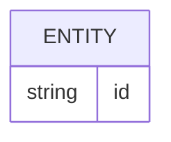

# Banco de dados

<!-- specsfy:documentator:start -->
## Fontes de persistência

| Arquivo |
| --- |
| .kiro\specs\vehicle-maintenance-system\deploy-migrations.sh |
| .kiro\specs\vehicle-maintenance-system\MIGRATION_SUMMARY.md |
| .worktrees\architecture-ai-scalability\.kiro\specs\vehicle-maintenance-system\deploy-migrations.sh |
| .worktrees\architecture-ai-scalability\.kiro\specs\vehicle-maintenance-system\MIGRATION_SUMMARY.md |
| .worktrees\architecture-ai-scalability\src\domains\ia\agent-core\conversation-migration-security.test.ts |
| .worktrees\architecture-ai-scalability\src\domains\ia\agent-core\migration-security.test.ts |
| .worktrees\architecture-ai-scalability\supabase\.temp\storage-migration |
| .worktrees\architecture-ai-scalability\supabase\fix_admin_rls.sql |
| .worktrees\architecture-ai-scalability\supabase\migrations\1.profile.sql |
| .worktrees\architecture-ai-scalability\supabase\migrations\10.avatar.sql |
| .worktrees\architecture-ai-scalability\supabase\migrations\10.chat_ia.sql |
| .worktrees\architecture-ai-scalability\supabase\migrations\11.fix_telefone_cadastro.sql |
| .worktrees\architecture-ai-scalability\supabase\migrations\12.ia.sql |
| .worktrees\architecture-ai-scalability\supabase\migrations\13.fix_ia_analysis_results.sql |
| .worktrees\architecture-ai-scalability\supabase\migrations\14.delete_account.sql |
| .worktrees\architecture-ai-scalability\supabase\migrations\15.edge-functions-n8n.sql |
| .worktrees\architecture-ai-scalability\supabase\migrations\16.categorias-mockup.sql |
| .worktrees\architecture-ai-scalability\supabase\migrations\17.add_role_to_profiles.sql |
| .worktrees\architecture-ai-scalability\supabase\migrations\18.debt_reminders.sql |
| .worktrees\architecture-ai-scalability\supabase\migrations\19.system_settings.sql |
| .worktrees\architecture-ai-scalability\supabase\migrations\2.receitas-despesas-categorias.sql |
| .worktrees\architecture-ai-scalability\supabase\migrations\20.process_reminders_cron.sql |
| .worktrees\architecture-ai-scalability\supabase\migrations\20250731_ficha_tecnica_validade.sql |
| .worktrees\architecture-ai-scalability\supabase\migrations\20250802_features_v31.sql |
| .worktrees\architecture-ai-scalability\supabase\migrations\20250802_transacoes_itens.sql |
| .worktrees\architecture-ai-scalability\supabase\migrations\20250803_compromissos.sql |
| .worktrees\architecture-ai-scalability\supabase\migrations\20250803_faturas_cartao.sql |
| .worktrees\architecture-ai-scalability\supabase\migrations\20250803_notificacoes.sql |
| .worktrees\architecture-ai-scalability\supabase\migrations\20250806_investimentos_completo.sql |
| .worktrees\architecture-ai-scalability\supabase\migrations\20250806_investimentos_melhorias.sql |
| .worktrees\architecture-ai-scalability\supabase\migrations\20260817120000_equipe_centro_rh_financeiro.sql |
| .worktrees\architecture-ai-scalability\supabase\migrations\20260817130000_equipe_obrigacoes_mensais.sql |
| .worktrees\architecture-ai-scalability\supabase\migrations\20260817140000_equipe_configuracao_trabalhista.sql |
| .worktrees\architecture-ai-scalability\supabase\migrations\20260818010000_wallet_ai_phase1_security.sql |
| .worktrees\architecture-ai-scalability\supabase\migrations\20260818020000_wallet_ai_conversations.sql |
| .worktrees\architecture-ai-scalability\supabase\migrations\20260818030000_wallet_ai_action_proposals.sql |
| .worktrees\architecture-ai-scalability\supabase\migrations\20260818120000_telegram_propostas.sql |
| .worktrees\architecture-ai-scalability\supabase\migrations\20260818130000_lembretes_automaticos.sql |
| .worktrees\architecture-ai-scalability\supabase\migrations\20260819180000_nf_compra_estoque_custo_audio.sql |
| .worktrees\architecture-ai-scalability\supabase\migrations\20260819190000_margem_real_sync_produtos.sql |
| .worktrees\architecture-ai-scalability\supabase\migrations\20260819193000_alertas_preco_pendentes.sql |
| .worktrees\architecture-ai-scalability\supabase\migrations\20260819220000_sefaz_certificados_integracao.sql |
| .worktrees\architecture-ai-scalability\supabase\migrations\20260821100000_importacao_fatura_segura_atomica.sql |
| .worktrees\architecture-ai-scalability\supabase\migrations\20260821120000_backfill_workspace_contas_cartoes.sql |
| .worktrees\architecture-ai-scalability\supabase\migrations\20260821130000_backfill_workspace_receitas_dividas.sql |
| .worktrees\architecture-ai-scalability\supabase\migrations\20260825120000_pluggy_items_security.sql |
| .worktrees\architecture-ai-scalability\supabase\migrations\20260825130000_merge_nf_multipage_page.sql |
| .worktrees\architecture-ai-scalability\supabase\migrations\20260825180000_pluggy_credit_card_transactions.sql |
| .worktrees\architecture-ai-scalability\supabase\migrations\20260825220000_harden_rls_database_advisors.sql |
| .worktrees\architecture-ai-scalability\supabase\migrations\20260826120000_ia_config_api_key_protection.sql |
| .worktrees\architecture-ai-scalability\supabase\migrations\20260827130000_document_multipage_sessions_and_storage.sql |
| .worktrees\architecture-ai-scalability\supabase\migrations\20260904120000_wallet_ai_action_proposals_columns.sql |
| .worktrees\architecture-ai-scalability\supabase\migrations\20260905120000_telegram_processed_updates.sql |
| .worktrees\architecture-ai-scalability\supabase\migrations\21.whatsapp_number_setting.sql |
| .worktrees\architecture-ai-scalability\supabase\migrations\22.contact_settings.sql |
| .worktrees\architecture-ai-scalability\supabase\migrations\23.planos_manutencao_veiculo.sql |
| .worktrees\architecture-ai-scalability\supabase\migrations\24.manutencoes_customizadas.sql |
| .worktrees\architecture-ai-scalability\supabase\migrations\25.lembretes_manutencao.sql |
| .worktrees\architecture-ai-scalability\supabase\migrations\26.webhooks_manutencao.sql |
| .worktrees\architecture-ai-scalability\supabase\migrations\27.logs_webhooks_manutencao.sql |
| .worktrees\architecture-ai-scalability\supabase\migrations\28.rls_summary.md |
| .worktrees\architecture-ai-scalability\supabase\migrations\28.rls_verification_manutencao.sql |
| .worktrees\architecture-ai-scalability\supabase\migrations\29.additional_indexes_manutencao.sql |
| .worktrees\architecture-ai-scalability\supabase\migrations\29.indexes_summary.md |
| .worktrees\architecture-ai-scalability\supabase\migrations\3.transacoes.sql |
| .worktrees\architecture-ai-scalability\supabase\migrations\30.cron_lembretes_manutencao.sql |
| .worktrees\architecture-ai-scalability\supabase\migrations\31.migrate_existing_manutencoes.sql |
| .worktrees\architecture-ai-scalability\supabase\migrations\31.migrate_existing_manutencoes_test.sql |
| .worktrees\architecture-ai-scalability\supabase\migrations\31.migrate_existing_manutencoes_validate.sql |
| .worktrees\architecture-ai-scalability\supabase\migrations\31.README.md |
| .worktrees\architecture-ai-scalability\supabase\migrations\32.contas_usuario.sql |
| .worktrees\architecture-ai-scalability\supabase\migrations\33.pagamentos_dividas.sql |
| .worktrees\architecture-ai-scalability\supabase\migrations\34.tags.sql |
| .worktrees\architecture-ai-scalability\supabase\migrations\35.anexos_transacoes.sql |
| .worktrees\architecture-ai-scalability\supabase\migrations\36.transacoes_recorrentes.sql |
| .worktrees\architecture-ai-scalability\supabase\migrations\37.add_payment_tracking_columns.sql |
| .worktrees\architecture-ai-scalability\supabase\migrations\38.storage_anexos_transacoes.README.md |
| .worktrees\architecture-ai-scalability\supabase\migrations\38.storage_anexos_transacoes.sql |
| .worktrees\architecture-ai-scalability\supabase\migrations\39.cron_recurring_transactions.sql |
| .worktrees\architecture-ai-scalability\supabase\migrations\4.dividas.sql |
| .worktrees\architecture-ai-scalability\supabase\migrations\40.security_fix_functions_search_path.sql |
| .worktrees\architecture-ai-scalability\supabase\migrations\41.performance_optimize_rls_policies.sql |
| .worktrees\architecture-ai-scalability\supabase\migrations\42.performance_add_missing_indexes.sql |
| .worktrees\architecture-ai-scalability\supabase\migrations\43.fix_user_registration_sync.sql |
| .worktrees\architecture-ai-scalability\supabase\migrations\44.update_handle_new_user_trigger.sql |
| .worktrees\architecture-ai-scalability\supabase\migrations\45.create_user_profile_complete_view.sql |
| .worktrees\architecture-ai-scalability\supabase\migrations\46.create_get_user_profile_by_phone.sql |
| .worktrees\architecture-ai-scalability\supabase\migrations\47.add_voucher_payment_method.sql |
| .worktrees\architecture-ai-scalability\supabase\migrations\48.create_budget_allocations.sql |
| .worktrees\architecture-ai-scalability\supabase\migrations\49.organizze_features_schema.sql |
| .worktrees\architecture-ai-scalability\supabase\migrations\5.metas.sql |
| .worktrees\architecture-ai-scalability\supabase\migrations\50.eyemobile_integration.sql |
| .worktrees\architecture-ai-scalability\supabase\migrations\51.divipay_integration.sql |
| .worktrees\architecture-ai-scalability\supabase\migrations\51.eyemobile_produtos.sql |
| .worktrees\architecture-ai-scalability\supabase\migrations\52.channel_mappings.sql |
| .worktrees\architecture-ai-scalability\supabase\migrations\52_workspaces_schema.sql |
| .worktrees\architecture-ai-scalability\supabase\migrations\53.ia_leitura_erros.sql |
| .worktrees\architecture-ai-scalability\supabase\migrations\53_installment_engine_schema.sql |
| .worktrees\architecture-ai-scalability\supabase\migrations\54.equipe.sql |
| .worktrees\architecture-ai-scalability\supabase\migrations\54_notifications_schema.sql |
| .worktrees\architecture-ai-scalability\supabase\migrations\55_conciliacao_divipay.sql |
| .worktrees\architecture-ai-scalability\supabase\migrations\56_workspace_despesas_automaticas.sql |
| .worktrees\architecture-ai-scalability\supabase\migrations\57_backfill_workspace_transacoes.sql |
| .worktrees\architecture-ai-scalability\supabase\migrations\58_vale_transporte_diario.sql |
| .worktrees\architecture-ai-scalability\supabase\migrations\59_acerto_semanal_corrigido.sql |
| .worktrees\architecture-ai-scalability\supabase\migrations\6.mercado.sql |
| .worktrees\architecture-ai-scalability\supabase\migrations\60_ficha_tecnica_final.sql |
| .worktrees\architecture-ai-scalability\supabase\migrations\61_contatos_emergencia.sql |
| .worktrees\architecture-ai-scalability\supabase\migrations\62_escala_folguistas.sql |
| .worktrees\architecture-ai-scalability\supabase\migrations\63_eyemobile_cache.sql |
| .worktrees\architecture-ai-scalability\supabase\migrations\65_fatura_cartao.sql |
| .worktrees\architecture-ai-scalability\supabase\migrations\66_contas_datas_fatura.sql |
| .worktrees\architecture-ai-scalability\supabase\migrations\68_corrigir_fatura_cartao.sql |
| .worktrees\architecture-ai-scalability\supabase\migrations\7.veiculos.sql |
| .worktrees\architecture-ai-scalability\supabase\migrations\74_endurecimento_importador_fatura.sql |
| .worktrees\architecture-ai-scalability\supabase\migrations\8.trigger_fix_veiculos.sql |
| .worktrees\architecture-ai-scalability\supabase\migrations\9.fix_profile.sql |
| .worktrees\architecture-ai-scalability\supabase\migrations\IMPORTANT_INDEXES_ADDED.md |
| .worktrees\architecture-ai-scalability\supabase\migrations\INDEX_ANALYSIS.md |
| .worktrees\architecture-ai-scalability\supabase\migrations\MIGRATION_GUIDE.md |
| .worktrees\architecture-ai-scalability\supabase\migrations\RLS_VERIFICATION_REPORT.md |
| .worktrees\architecture-ai-scalability\supabase\migrations\rollback\20260818010000_wallet_ai_phase1_security.down.sql |
| .worktrees\architecture-ai-scalability\supabase\migrations\rollback\20260818020000_wallet_ai_conversations.down.sql |
| .worktrees\architecture-ai-scalability\supabase\migrations\rollback\20260818030000_wallet_ai_action_proposals.down.sql |
| .worktrees\architecture-ai-scalability\supabase\migrations\rollback\20260904120000_wallet_ai_action_proposals_columns.down.sql |
| .worktrees\architecture-ai-scalability\supabase\migrations\rollback\20260905120000_telegram_processed_updates.down.sql |
| .worktrees\architecture-ai-scalability\supabase\tests\equipe_centro_rh_financeiro.sql |
| .worktrees\architecture-ai-scalability\tests\supabase-equipe\supabase\migrations\20260817000000_legacy_equipe_baseline.sql |
| .worktrees\danfe-fiscal-service-v2\.kiro\specs\vehicle-maintenance-system\deploy-migrations.sh |
| .worktrees\danfe-fiscal-service-v2\.kiro\specs\vehicle-maintenance-system\MIGRATION_SUMMARY.md |
| .worktrees\danfe-fiscal-service-v2\src\domains\ia\agent-core\conversation-migration-security.test.ts |
| .worktrees\danfe-fiscal-service-v2\src\domains\ia\agent-core\migration-security.test.ts |
| .worktrees\danfe-fiscal-service-v2\supabase\.temp\storage-migration |
| .worktrees\danfe-fiscal-service-v2\supabase\fix_admin_rls.sql |
| .worktrees\danfe-fiscal-service-v2\supabase\migrations\1.profile.sql |
| .worktrees\danfe-fiscal-service-v2\supabase\migrations\10.avatar.sql |
| .worktrees\danfe-fiscal-service-v2\supabase\migrations\10.chat_ia.sql |
| .worktrees\danfe-fiscal-service-v2\supabase\migrations\11.fix_telefone_cadastro.sql |
| .worktrees\danfe-fiscal-service-v2\supabase\migrations\12.ia.sql |
| .worktrees\danfe-fiscal-service-v2\supabase\migrations\13.fix_ia_analysis_results.sql |
| .worktrees\danfe-fiscal-service-v2\supabase\migrations\14.delete_account.sql |
| .worktrees\danfe-fiscal-service-v2\supabase\migrations\15.edge-functions-n8n.sql |
| .worktrees\danfe-fiscal-service-v2\supabase\migrations\16.categorias-mockup.sql |
| .worktrees\danfe-fiscal-service-v2\supabase\migrations\17.add_role_to_profiles.sql |
| .worktrees\danfe-fiscal-service-v2\supabase\migrations\18.debt_reminders.sql |
| .worktrees\danfe-fiscal-service-v2\supabase\migrations\19.system_settings.sql |
| .worktrees\danfe-fiscal-service-v2\supabase\migrations\2.receitas-despesas-categorias.sql |
| .worktrees\danfe-fiscal-service-v2\supabase\migrations\20.process_reminders_cron.sql |
| .worktrees\danfe-fiscal-service-v2\supabase\migrations\20250731_ficha_tecnica_validade.sql |
| .worktrees\danfe-fiscal-service-v2\supabase\migrations\20250802_features_v31.sql |
| .worktrees\danfe-fiscal-service-v2\supabase\migrations\20250802_transacoes_itens.sql |
| .worktrees\danfe-fiscal-service-v2\supabase\migrations\20250803_compromissos.sql |
| .worktrees\danfe-fiscal-service-v2\supabase\migrations\20250803_faturas_cartao.sql |
| .worktrees\danfe-fiscal-service-v2\supabase\migrations\20250803_notificacoes.sql |
| .worktrees\danfe-fiscal-service-v2\supabase\migrations\20250806_investimentos_completo.sql |
| .worktrees\danfe-fiscal-service-v2\supabase\migrations\20250806_investimentos_melhorias.sql |
| .worktrees\danfe-fiscal-service-v2\supabase\migrations\20260817120000_equipe_centro_rh_financeiro.sql |
| .worktrees\danfe-fiscal-service-v2\supabase\migrations\20260817130000_equipe_obrigacoes_mensais.sql |
| .worktrees\danfe-fiscal-service-v2\supabase\migrations\20260817140000_equipe_configuracao_trabalhista.sql |
| .worktrees\danfe-fiscal-service-v2\supabase\migrations\20260818010000_wallet_ai_phase1_security.sql |
| .worktrees\danfe-fiscal-service-v2\supabase\migrations\20260818020000_wallet_ai_conversations.sql |
| .worktrees\danfe-fiscal-service-v2\supabase\migrations\20260818030000_wallet_ai_action_proposals.sql |
| .worktrees\danfe-fiscal-service-v2\supabase\migrations\20260818120000_telegram_propostas.sql |
| .worktrees\danfe-fiscal-service-v2\supabase\migrations\20260818130000_lembretes_automaticos.sql |
| .worktrees\danfe-fiscal-service-v2\supabase\migrations\20260819180000_nf_compra_estoque_custo_audio.sql |
| .worktrees\danfe-fiscal-service-v2\supabase\migrations\20260819190000_margem_real_sync_produtos.sql |
| .worktrees\danfe-fiscal-service-v2\supabase\migrations\20260819193000_alertas_preco_pendentes.sql |
| .worktrees\danfe-fiscal-service-v2\supabase\migrations\20260819220000_sefaz_certificados_integracao.sql |
| .worktrees\danfe-fiscal-service-v2\supabase\migrations\20260821100000_importacao_fatura_segura_atomica.sql |
| .worktrees\danfe-fiscal-service-v2\supabase\migrations\20260821120000_backfill_workspace_contas_cartoes.sql |
| .worktrees\danfe-fiscal-service-v2\supabase\migrations\20260821130000_backfill_workspace_receitas_dividas.sql |
| .worktrees\danfe-fiscal-service-v2\supabase\migrations\20260825130000_merge_nf_multipage_page.sql |
| .worktrees\danfe-fiscal-service-v2\supabase\migrations\21.whatsapp_number_setting.sql |
| .worktrees\danfe-fiscal-service-v2\supabase\migrations\22.contact_settings.sql |
| .worktrees\danfe-fiscal-service-v2\supabase\migrations\23.planos_manutencao_veiculo.sql |
| .worktrees\danfe-fiscal-service-v2\supabase\migrations\24.manutencoes_customizadas.sql |
| .worktrees\danfe-fiscal-service-v2\supabase\migrations\25.lembretes_manutencao.sql |
| .worktrees\danfe-fiscal-service-v2\supabase\migrations\26.webhooks_manutencao.sql |
| .worktrees\danfe-fiscal-service-v2\supabase\migrations\27.logs_webhooks_manutencao.sql |
| .worktrees\danfe-fiscal-service-v2\supabase\migrations\28.rls_summary.md |
| .worktrees\danfe-fiscal-service-v2\supabase\migrations\28.rls_verification_manutencao.sql |
| .worktrees\danfe-fiscal-service-v2\supabase\migrations\29.additional_indexes_manutencao.sql |
| .worktrees\danfe-fiscal-service-v2\supabase\migrations\29.indexes_summary.md |
| .worktrees\danfe-fiscal-service-v2\supabase\migrations\3.transacoes.sql |
| .worktrees\danfe-fiscal-service-v2\supabase\migrations\30.cron_lembretes_manutencao.sql |
| .worktrees\danfe-fiscal-service-v2\supabase\migrations\31.migrate_existing_manutencoes.sql |
| .worktrees\danfe-fiscal-service-v2\supabase\migrations\31.migrate_existing_manutencoes_test.sql |
| .worktrees\danfe-fiscal-service-v2\supabase\migrations\31.migrate_existing_manutencoes_validate.sql |
| .worktrees\danfe-fiscal-service-v2\supabase\migrations\31.README.md |
| .worktrees\danfe-fiscal-service-v2\supabase\migrations\32.contas_usuario.sql |
| .worktrees\danfe-fiscal-service-v2\supabase\migrations\33.pagamentos_dividas.sql |
| .worktrees\danfe-fiscal-service-v2\supabase\migrations\34.tags.sql |
| .worktrees\danfe-fiscal-service-v2\supabase\migrations\35.anexos_transacoes.sql |
| .worktrees\danfe-fiscal-service-v2\supabase\migrations\36.transacoes_recorrentes.sql |
| .worktrees\danfe-fiscal-service-v2\supabase\migrations\37.add_payment_tracking_columns.sql |
| .worktrees\danfe-fiscal-service-v2\supabase\migrations\38.storage_anexos_transacoes.README.md |
| .worktrees\danfe-fiscal-service-v2\supabase\migrations\38.storage_anexos_transacoes.sql |
| .worktrees\danfe-fiscal-service-v2\supabase\migrations\39.cron_recurring_transactions.sql |
| .worktrees\danfe-fiscal-service-v2\supabase\migrations\4.dividas.sql |
| .worktrees\danfe-fiscal-service-v2\supabase\migrations\40.security_fix_functions_search_path.sql |
| .worktrees\danfe-fiscal-service-v2\supabase\migrations\41.performance_optimize_rls_policies.sql |
| .worktrees\danfe-fiscal-service-v2\supabase\migrations\42.performance_add_missing_indexes.sql |
| .worktrees\danfe-fiscal-service-v2\supabase\migrations\43.fix_user_registration_sync.sql |
| .worktrees\danfe-fiscal-service-v2\supabase\migrations\44.update_handle_new_user_trigger.sql |
| .worktrees\danfe-fiscal-service-v2\supabase\migrations\45.create_user_profile_complete_view.sql |
| .worktrees\danfe-fiscal-service-v2\supabase\migrations\46.create_get_user_profile_by_phone.sql |
| .worktrees\danfe-fiscal-service-v2\supabase\migrations\47.add_voucher_payment_method.sql |
| .worktrees\danfe-fiscal-service-v2\supabase\migrations\48.create_budget_allocations.sql |
| .worktrees\danfe-fiscal-service-v2\supabase\migrations\49.organizze_features_schema.sql |
| .worktrees\danfe-fiscal-service-v2\supabase\migrations\5.metas.sql |
| .worktrees\danfe-fiscal-service-v2\supabase\migrations\50.eyemobile_integration.sql |
| .worktrees\danfe-fiscal-service-v2\supabase\migrations\51.divipay_integration.sql |
| .worktrees\danfe-fiscal-service-v2\supabase\migrations\51.eyemobile_produtos.sql |
| .worktrees\danfe-fiscal-service-v2\supabase\migrations\52.channel_mappings.sql |
| .worktrees\danfe-fiscal-service-v2\supabase\migrations\52_workspaces_schema.sql |
| .worktrees\danfe-fiscal-service-v2\supabase\migrations\53.ia_leitura_erros.sql |
| .worktrees\danfe-fiscal-service-v2\supabase\migrations\53_installment_engine_schema.sql |
| .worktrees\danfe-fiscal-service-v2\supabase\migrations\54.equipe.sql |
| .worktrees\danfe-fiscal-service-v2\supabase\migrations\54_notifications_schema.sql |
| .worktrees\danfe-fiscal-service-v2\supabase\migrations\55_conciliacao_divipay.sql |
| .worktrees\danfe-fiscal-service-v2\supabase\migrations\56_workspace_despesas_automaticas.sql |
| .worktrees\danfe-fiscal-service-v2\supabase\migrations\57_backfill_workspace_transacoes.sql |
| .worktrees\danfe-fiscal-service-v2\supabase\migrations\58_vale_transporte_diario.sql |
| .worktrees\danfe-fiscal-service-v2\supabase\migrations\59_acerto_semanal_corrigido.sql |
| .worktrees\danfe-fiscal-service-v2\supabase\migrations\6.mercado.sql |
| .worktrees\danfe-fiscal-service-v2\supabase\migrations\60_ficha_tecnica_final.sql |
| .worktrees\danfe-fiscal-service-v2\supabase\migrations\61_contatos_emergencia.sql |
| .worktrees\danfe-fiscal-service-v2\supabase\migrations\62_escala_folguistas.sql |
| .worktrees\danfe-fiscal-service-v2\supabase\migrations\63_eyemobile_cache.sql |
| .worktrees\danfe-fiscal-service-v2\supabase\migrations\65_fatura_cartao.sql |
| .worktrees\danfe-fiscal-service-v2\supabase\migrations\66_contas_datas_fatura.sql |
| .worktrees\danfe-fiscal-service-v2\supabase\migrations\68_corrigir_fatura_cartao.sql |
| .worktrees\danfe-fiscal-service-v2\supabase\migrations\7.veiculos.sql |
| .worktrees\danfe-fiscal-service-v2\supabase\migrations\74_endurecimento_importador_fatura.sql |
| .worktrees\danfe-fiscal-service-v2\supabase\migrations\8.trigger_fix_veiculos.sql |
| .worktrees\danfe-fiscal-service-v2\supabase\migrations\9.fix_profile.sql |
| .worktrees\danfe-fiscal-service-v2\supabase\migrations\IMPORTANT_INDEXES_ADDED.md |
| .worktrees\danfe-fiscal-service-v2\supabase\migrations\INDEX_ANALYSIS.md |
| .worktrees\danfe-fiscal-service-v2\supabase\migrations\MIGRATION_GUIDE.md |
| .worktrees\danfe-fiscal-service-v2\supabase\migrations\RLS_VERIFICATION_REPORT.md |
| .worktrees\danfe-fiscal-service-v2\supabase\migrations\rollback\20260818010000_wallet_ai_phase1_security.down.sql |
| .worktrees\danfe-fiscal-service-v2\supabase\migrations\rollback\20260818020000_wallet_ai_conversations.down.sql |
| .worktrees\danfe-fiscal-service-v2\supabase\migrations\rollback\20260818030000_wallet_ai_action_proposals.down.sql |
| .worktrees\danfe-fiscal-service-v2\supabase\tests\equipe_centro_rh_financeiro.sql |
| .worktrees\danfe-fiscal-service-v2\tests\supabase-equipe\supabase\migrations\20260817000000_legacy_equipe_baseline.sql |
| .worktrees\equipe-centro-rh-financeiro\.kiro\specs\vehicle-maintenance-system\deploy-migrations.sh |
| .worktrees\equipe-centro-rh-financeiro\.kiro\specs\vehicle-maintenance-system\MIGRATION_SUMMARY.md |
| .worktrees\equipe-centro-rh-financeiro\supabase\.temp\storage-migration |
| .worktrees\equipe-centro-rh-financeiro\supabase\fix_admin_rls.sql |
| .worktrees\equipe-centro-rh-financeiro\supabase\migrations\1.profile.sql |
| .worktrees\equipe-centro-rh-financeiro\supabase\migrations\10.avatar.sql |
| .worktrees\equipe-centro-rh-financeiro\supabase\migrations\10.chat_ia.sql |
| .worktrees\equipe-centro-rh-financeiro\supabase\migrations\11.fix_telefone_cadastro.sql |
| .worktrees\equipe-centro-rh-financeiro\supabase\migrations\12.ia.sql |
| .worktrees\equipe-centro-rh-financeiro\supabase\migrations\13.fix_ia_analysis_results.sql |
| .worktrees\equipe-centro-rh-financeiro\supabase\migrations\14.delete_account.sql |
| .worktrees\equipe-centro-rh-financeiro\supabase\migrations\15.edge-functions-n8n.sql |
| .worktrees\equipe-centro-rh-financeiro\supabase\migrations\16.categorias-mockup.sql |
| .worktrees\equipe-centro-rh-financeiro\supabase\migrations\17.add_role_to_profiles.sql |
| .worktrees\equipe-centro-rh-financeiro\supabase\migrations\18.debt_reminders.sql |
| .worktrees\equipe-centro-rh-financeiro\supabase\migrations\19.system_settings.sql |
| .worktrees\equipe-centro-rh-financeiro\supabase\migrations\2.receitas-despesas-categorias.sql |
| .worktrees\equipe-centro-rh-financeiro\supabase\migrations\20.process_reminders_cron.sql |
| .worktrees\equipe-centro-rh-financeiro\supabase\migrations\20250731_ficha_tecnica_validade.sql |
| .worktrees\equipe-centro-rh-financeiro\supabase\migrations\20250802_features_v31.sql |
| .worktrees\equipe-centro-rh-financeiro\supabase\migrations\20250802_transacoes_itens.sql |
| .worktrees\equipe-centro-rh-financeiro\supabase\migrations\20250803_compromissos.sql |
| .worktrees\equipe-centro-rh-financeiro\supabase\migrations\20250803_faturas_cartao.sql |
| .worktrees\equipe-centro-rh-financeiro\supabase\migrations\20250803_notificacoes.sql |
| .worktrees\equipe-centro-rh-financeiro\supabase\migrations\20250806_investimentos_completo.sql |
| .worktrees\equipe-centro-rh-financeiro\supabase\migrations\20250806_investimentos_melhorias.sql |
| .worktrees\equipe-centro-rh-financeiro\supabase\migrations\21.whatsapp_number_setting.sql |
| .worktrees\equipe-centro-rh-financeiro\supabase\migrations\22.contact_settings.sql |
| .worktrees\equipe-centro-rh-financeiro\supabase\migrations\23.planos_manutencao_veiculo.sql |
| .worktrees\equipe-centro-rh-financeiro\supabase\migrations\24.manutencoes_customizadas.sql |
| .worktrees\equipe-centro-rh-financeiro\supabase\migrations\25.lembretes_manutencao.sql |
| .worktrees\equipe-centro-rh-financeiro\supabase\migrations\26.webhooks_manutencao.sql |
| .worktrees\equipe-centro-rh-financeiro\supabase\migrations\27.logs_webhooks_manutencao.sql |
| .worktrees\equipe-centro-rh-financeiro\supabase\migrations\28.rls_summary.md |
| .worktrees\equipe-centro-rh-financeiro\supabase\migrations\28.rls_verification_manutencao.sql |
| .worktrees\equipe-centro-rh-financeiro\supabase\migrations\29.additional_indexes_manutencao.sql |
| .worktrees\equipe-centro-rh-financeiro\supabase\migrations\29.indexes_summary.md |
| .worktrees\equipe-centro-rh-financeiro\supabase\migrations\3.transacoes.sql |
| .worktrees\equipe-centro-rh-financeiro\supabase\migrations\30.cron_lembretes_manutencao.sql |
| .worktrees\equipe-centro-rh-financeiro\supabase\migrations\31.migrate_existing_manutencoes.sql |
| .worktrees\equipe-centro-rh-financeiro\supabase\migrations\31.migrate_existing_manutencoes_test.sql |
| .worktrees\equipe-centro-rh-financeiro\supabase\migrations\31.migrate_existing_manutencoes_validate.sql |
| .worktrees\equipe-centro-rh-financeiro\supabase\migrations\31.README.md |
| .worktrees\equipe-centro-rh-financeiro\supabase\migrations\32.contas_usuario.sql |
| .worktrees\equipe-centro-rh-financeiro\supabase\migrations\33.pagamentos_dividas.sql |
| .worktrees\equipe-centro-rh-financeiro\supabase\migrations\34.tags.sql |
| .worktrees\equipe-centro-rh-financeiro\supabase\migrations\35.anexos_transacoes.sql |
| .worktrees\equipe-centro-rh-financeiro\supabase\migrations\36.transacoes_recorrentes.sql |
| .worktrees\equipe-centro-rh-financeiro\supabase\migrations\37.add_payment_tracking_columns.sql |
| .worktrees\equipe-centro-rh-financeiro\supabase\migrations\38.storage_anexos_transacoes.README.md |
| .worktrees\equipe-centro-rh-financeiro\supabase\migrations\38.storage_anexos_transacoes.sql |
| .worktrees\equipe-centro-rh-financeiro\supabase\migrations\39.cron_recurring_transactions.sql |
| .worktrees\equipe-centro-rh-financeiro\supabase\migrations\4.dividas.sql |
| .worktrees\equipe-centro-rh-financeiro\supabase\migrations\40.security_fix_functions_search_path.sql |
| .worktrees\equipe-centro-rh-financeiro\supabase\migrations\41.performance_optimize_rls_policies.sql |
| .worktrees\equipe-centro-rh-financeiro\supabase\migrations\42.performance_add_missing_indexes.sql |
| .worktrees\equipe-centro-rh-financeiro\supabase\migrations\43.fix_user_registration_sync.sql |
| .worktrees\equipe-centro-rh-financeiro\supabase\migrations\44.update_handle_new_user_trigger.sql |
| .worktrees\equipe-centro-rh-financeiro\supabase\migrations\45.create_user_profile_complete_view.sql |
| .worktrees\equipe-centro-rh-financeiro\supabase\migrations\46.create_get_user_profile_by_phone.sql |
| .worktrees\equipe-centro-rh-financeiro\supabase\migrations\47.add_voucher_payment_method.sql |
| .worktrees\equipe-centro-rh-financeiro\supabase\migrations\48.create_budget_allocations.sql |
| .worktrees\equipe-centro-rh-financeiro\supabase\migrations\49.organizze_features_schema.sql |
| .worktrees\equipe-centro-rh-financeiro\supabase\migrations\5.metas.sql |
| .worktrees\equipe-centro-rh-financeiro\supabase\migrations\50.eyemobile_integration.sql |
| .worktrees\equipe-centro-rh-financeiro\supabase\migrations\51.divipay_integration.sql |
| .worktrees\equipe-centro-rh-financeiro\supabase\migrations\51.eyemobile_produtos.sql |
| .worktrees\equipe-centro-rh-financeiro\supabase\migrations\52.channel_mappings.sql |
| .worktrees\equipe-centro-rh-financeiro\supabase\migrations\52_workspaces_schema.sql |
| .worktrees\equipe-centro-rh-financeiro\supabase\migrations\53.ia_leitura_erros.sql |
| .worktrees\equipe-centro-rh-financeiro\supabase\migrations\53_installment_engine_schema.sql |
| .worktrees\equipe-centro-rh-financeiro\supabase\migrations\54.equipe.sql |
| .worktrees\equipe-centro-rh-financeiro\supabase\migrations\54_notifications_schema.sql |
| .worktrees\equipe-centro-rh-financeiro\supabase\migrations\55_conciliacao_divipay.sql |
| .worktrees\equipe-centro-rh-financeiro\supabase\migrations\56_workspace_despesas_automaticas.sql |
| .worktrees\equipe-centro-rh-financeiro\supabase\migrations\57_backfill_workspace_transacoes.sql |
| .worktrees\equipe-centro-rh-financeiro\supabase\migrations\58_vale_transporte_diario.sql |
| .worktrees\equipe-centro-rh-financeiro\supabase\migrations\59_acerto_semanal_corrigido.sql |
| .worktrees\equipe-centro-rh-financeiro\supabase\migrations\6.mercado.sql |
| .worktrees\equipe-centro-rh-financeiro\supabase\migrations\60_ficha_tecnica_final.sql |
| .worktrees\equipe-centro-rh-financeiro\supabase\migrations\61_contatos_emergencia.sql |
| .worktrees\equipe-centro-rh-financeiro\supabase\migrations\62_escala_folguistas.sql |
| .worktrees\equipe-centro-rh-financeiro\supabase\migrations\63_eyemobile_cache.sql |
| .worktrees\equipe-centro-rh-financeiro\supabase\migrations\65_fatura_cartao.sql |
| .worktrees\equipe-centro-rh-financeiro\supabase\migrations\66_contas_datas_fatura.sql |
| .worktrees\equipe-centro-rh-financeiro\supabase\migrations\68_corrigir_fatura_cartao.sql |
| .worktrees\equipe-centro-rh-financeiro\supabase\migrations\7.veiculos.sql |
| .worktrees\equipe-centro-rh-financeiro\supabase\migrations\74_endurecimento_importador_fatura.sql |
| .worktrees\equipe-centro-rh-financeiro\supabase\migrations\75_equipe_centro_rh_financeiro.sql |
| .worktrees\equipe-centro-rh-financeiro\supabase\migrations\76_equipe_obrigacoes_mensais.sql |
| .worktrees\equipe-centro-rh-financeiro\supabase\migrations\8.trigger_fix_veiculos.sql |
| .worktrees\equipe-centro-rh-financeiro\supabase\migrations\9.fix_profile.sql |
| .worktrees\equipe-centro-rh-financeiro\supabase\migrations\IMPORTANT_INDEXES_ADDED.md |
| .worktrees\equipe-centro-rh-financeiro\supabase\migrations\INDEX_ANALYSIS.md |
| .worktrees\equipe-centro-rh-financeiro\supabase\migrations\MIGRATION_GUIDE.md |
| .worktrees\equipe-centro-rh-financeiro\supabase\migrations\RLS_VERIFICATION_REPORT.md |
| .worktrees\equipe-centro-rh-financeiro\supabase\tests\equipe_centro_rh_financeiro.sql |
| .worktrees\equipe-centro-rh-financeiro\tests\supabase-equipe\supabase\migrations\20260817000000_legacy_equipe_baseline.sql |
| .worktrees\equipe-rescisao-transporte\.kiro\specs\vehicle-maintenance-system\deploy-migrations.sh |
| .worktrees\equipe-rescisao-transporte\.kiro\specs\vehicle-maintenance-system\MIGRATION_SUMMARY.md |
| .worktrees\equipe-rescisao-transporte\supabase\.temp\storage-migration |
| .worktrees\equipe-rescisao-transporte\supabase\fix_admin_rls.sql |
| .worktrees\equipe-rescisao-transporte\supabase\migrations\1.profile.sql |
| .worktrees\equipe-rescisao-transporte\supabase\migrations\10.avatar.sql |
| .worktrees\equipe-rescisao-transporte\supabase\migrations\10.chat_ia.sql |
| .worktrees\equipe-rescisao-transporte\supabase\migrations\11.fix_telefone_cadastro.sql |
| .worktrees\equipe-rescisao-transporte\supabase\migrations\12.ia.sql |
| .worktrees\equipe-rescisao-transporte\supabase\migrations\13.fix_ia_analysis_results.sql |
| .worktrees\equipe-rescisao-transporte\supabase\migrations\14.delete_account.sql |
| .worktrees\equipe-rescisao-transporte\supabase\migrations\15.edge-functions-n8n.sql |
| .worktrees\equipe-rescisao-transporte\supabase\migrations\16.categorias-mockup.sql |
| .worktrees\equipe-rescisao-transporte\supabase\migrations\17.add_role_to_profiles.sql |
| .worktrees\equipe-rescisao-transporte\supabase\migrations\18.debt_reminders.sql |
| .worktrees\equipe-rescisao-transporte\supabase\migrations\19.system_settings.sql |
| .worktrees\equipe-rescisao-transporte\supabase\migrations\2.receitas-despesas-categorias.sql |
| .worktrees\equipe-rescisao-transporte\supabase\migrations\20.process_reminders_cron.sql |
| .worktrees\equipe-rescisao-transporte\supabase\migrations\20250731_ficha_tecnica_validade.sql |
| .worktrees\equipe-rescisao-transporte\supabase\migrations\20250802_features_v31.sql |
| .worktrees\equipe-rescisao-transporte\supabase\migrations\20250802_transacoes_itens.sql |
| .worktrees\equipe-rescisao-transporte\supabase\migrations\20250803_compromissos.sql |
| .worktrees\equipe-rescisao-transporte\supabase\migrations\20250803_faturas_cartao.sql |
| .worktrees\equipe-rescisao-transporte\supabase\migrations\20250803_notificacoes.sql |
| .worktrees\equipe-rescisao-transporte\supabase\migrations\20250806_investimentos_completo.sql |
| .worktrees\equipe-rescisao-transporte\supabase\migrations\20250806_investimentos_melhorias.sql |
| .worktrees\equipe-rescisao-transporte\supabase\migrations\20260817120000_equipe_centro_rh_financeiro.sql |
| .worktrees\equipe-rescisao-transporte\supabase\migrations\20260817130000_equipe_obrigacoes_mensais.sql |
| .worktrees\equipe-rescisao-transporte\supabase\migrations\20260817140000_equipe_configuracao_trabalhista.sql |
| .worktrees\equipe-rescisao-transporte\supabase\migrations\21.whatsapp_number_setting.sql |
| .worktrees\equipe-rescisao-transporte\supabase\migrations\22.contact_settings.sql |
| .worktrees\equipe-rescisao-transporte\supabase\migrations\23.planos_manutencao_veiculo.sql |
| .worktrees\equipe-rescisao-transporte\supabase\migrations\24.manutencoes_customizadas.sql |
| .worktrees\equipe-rescisao-transporte\supabase\migrations\25.lembretes_manutencao.sql |
| .worktrees\equipe-rescisao-transporte\supabase\migrations\26.webhooks_manutencao.sql |
| .worktrees\equipe-rescisao-transporte\supabase\migrations\27.logs_webhooks_manutencao.sql |
| .worktrees\equipe-rescisao-transporte\supabase\migrations\28.rls_summary.md |
| .worktrees\equipe-rescisao-transporte\supabase\migrations\28.rls_verification_manutencao.sql |
| .worktrees\equipe-rescisao-transporte\supabase\migrations\29.additional_indexes_manutencao.sql |
| .worktrees\equipe-rescisao-transporte\supabase\migrations\29.indexes_summary.md |
| .worktrees\equipe-rescisao-transporte\supabase\migrations\3.transacoes.sql |
| .worktrees\equipe-rescisao-transporte\supabase\migrations\30.cron_lembretes_manutencao.sql |
| .worktrees\equipe-rescisao-transporte\supabase\migrations\31.migrate_existing_manutencoes.sql |
| .worktrees\equipe-rescisao-transporte\supabase\migrations\31.migrate_existing_manutencoes_test.sql |
| .worktrees\equipe-rescisao-transporte\supabase\migrations\31.migrate_existing_manutencoes_validate.sql |
| .worktrees\equipe-rescisao-transporte\supabase\migrations\31.README.md |
| .worktrees\equipe-rescisao-transporte\supabase\migrations\32.contas_usuario.sql |
| .worktrees\equipe-rescisao-transporte\supabase\migrations\33.pagamentos_dividas.sql |
| .worktrees\equipe-rescisao-transporte\supabase\migrations\34.tags.sql |
| .worktrees\equipe-rescisao-transporte\supabase\migrations\35.anexos_transacoes.sql |
| .worktrees\equipe-rescisao-transporte\supabase\migrations\36.transacoes_recorrentes.sql |
| .worktrees\equipe-rescisao-transporte\supabase\migrations\37.add_payment_tracking_columns.sql |
| .worktrees\equipe-rescisao-transporte\supabase\migrations\38.storage_anexos_transacoes.README.md |
| .worktrees\equipe-rescisao-transporte\supabase\migrations\38.storage_anexos_transacoes.sql |
| .worktrees\equipe-rescisao-transporte\supabase\migrations\39.cron_recurring_transactions.sql |
| .worktrees\equipe-rescisao-transporte\supabase\migrations\4.dividas.sql |
| .worktrees\equipe-rescisao-transporte\supabase\migrations\40.security_fix_functions_search_path.sql |
| .worktrees\equipe-rescisao-transporte\supabase\migrations\41.performance_optimize_rls_policies.sql |
| .worktrees\equipe-rescisao-transporte\supabase\migrations\42.performance_add_missing_indexes.sql |
| .worktrees\equipe-rescisao-transporte\supabase\migrations\43.fix_user_registration_sync.sql |
| .worktrees\equipe-rescisao-transporte\supabase\migrations\44.update_handle_new_user_trigger.sql |
| .worktrees\equipe-rescisao-transporte\supabase\migrations\45.create_user_profile_complete_view.sql |
| .worktrees\equipe-rescisao-transporte\supabase\migrations\46.create_get_user_profile_by_phone.sql |
| .worktrees\equipe-rescisao-transporte\supabase\migrations\47.add_voucher_payment_method.sql |
| .worktrees\equipe-rescisao-transporte\supabase\migrations\48.create_budget_allocations.sql |
| .worktrees\equipe-rescisao-transporte\supabase\migrations\49.organizze_features_schema.sql |
| .worktrees\equipe-rescisao-transporte\supabase\migrations\5.metas.sql |
| .worktrees\equipe-rescisao-transporte\supabase\migrations\50.eyemobile_integration.sql |
| .worktrees\equipe-rescisao-transporte\supabase\migrations\51.divipay_integration.sql |
| .worktrees\equipe-rescisao-transporte\supabase\migrations\51.eyemobile_produtos.sql |
| .worktrees\equipe-rescisao-transporte\supabase\migrations\52.channel_mappings.sql |
| .worktrees\equipe-rescisao-transporte\supabase\migrations\52_workspaces_schema.sql |
| .worktrees\equipe-rescisao-transporte\supabase\migrations\53.ia_leitura_erros.sql |
| .worktrees\equipe-rescisao-transporte\supabase\migrations\53_installment_engine_schema.sql |
| .worktrees\equipe-rescisao-transporte\supabase\migrations\54.equipe.sql |
| .worktrees\equipe-rescisao-transporte\supabase\migrations\54_notifications_schema.sql |
| .worktrees\equipe-rescisao-transporte\supabase\migrations\55_conciliacao_divipay.sql |
| .worktrees\equipe-rescisao-transporte\supabase\migrations\56_workspace_despesas_automaticas.sql |
| .worktrees\equipe-rescisao-transporte\supabase\migrations\57_backfill_workspace_transacoes.sql |
| .worktrees\equipe-rescisao-transporte\supabase\migrations\58_vale_transporte_diario.sql |
| .worktrees\equipe-rescisao-transporte\supabase\migrations\59_acerto_semanal_corrigido.sql |
| .worktrees\equipe-rescisao-transporte\supabase\migrations\6.mercado.sql |
| .worktrees\equipe-rescisao-transporte\supabase\migrations\60_ficha_tecnica_final.sql |
| .worktrees\equipe-rescisao-transporte\supabase\migrations\61_contatos_emergencia.sql |
| .worktrees\equipe-rescisao-transporte\supabase\migrations\62_escala_folguistas.sql |
| .worktrees\equipe-rescisao-transporte\supabase\migrations\63_eyemobile_cache.sql |
| .worktrees\equipe-rescisao-transporte\supabase\migrations\65_fatura_cartao.sql |
| .worktrees\equipe-rescisao-transporte\supabase\migrations\66_contas_datas_fatura.sql |
| .worktrees\equipe-rescisao-transporte\supabase\migrations\68_corrigir_fatura_cartao.sql |
| .worktrees\equipe-rescisao-transporte\supabase\migrations\7.veiculos.sql |
| .worktrees\equipe-rescisao-transporte\supabase\migrations\74_endurecimento_importador_fatura.sql |
| .worktrees\equipe-rescisao-transporte\supabase\migrations\8.trigger_fix_veiculos.sql |
| .worktrees\equipe-rescisao-transporte\supabase\migrations\9.fix_profile.sql |
| .worktrees\equipe-rescisao-transporte\supabase\migrations\IMPORTANT_INDEXES_ADDED.md |
| .worktrees\equipe-rescisao-transporte\supabase\migrations\INDEX_ANALYSIS.md |
| .worktrees\equipe-rescisao-transporte\supabase\migrations\MIGRATION_GUIDE.md |
| .worktrees\equipe-rescisao-transporte\supabase\migrations\RLS_VERIFICATION_REPORT.md |
| .worktrees\equipe-rescisao-transporte\supabase\tests\equipe_centro_rh_financeiro.sql |
| .worktrees\equipe-rescisao-transporte\tests\supabase-equipe\supabase\migrations\20260817000000_legacy_equipe_baseline.sql |
| scripts\apply-phase-c-enforcement.sql |
| scripts\test-isolated-pg-security.sql |
| scripts\test-phase-abc-gating.sql |
| scripts\test-phase-abc-rehearsal.sql |
| scripts\test-real-schema-compat.sql |
| src\domains\ia\agent-core\conversation-migration-security.test.ts |
| src\domains\ia\agent-core\migration-security.test.ts |
| supabase\.temp\storage-migration |
| supabase\diagnostics\diagnostico_produtos_eyemobile_legados.sql |
| supabase\fix_admin_rls.sql |
| supabase\migrations\1.profile.sql |
| supabase\migrations\10.avatar.sql |
| supabase\migrations\10.chat_ia.sql |
| supabase\migrations\11.fix_telefone_cadastro.sql |
| supabase\migrations\12.ia.sql |
| supabase\migrations\13.fix_ia_analysis_results.sql |
| supabase\migrations\14.delete_account.sql |
| supabase\migrations\15.edge-functions-n8n.sql |
| supabase\migrations\16.categorias-mockup.sql |
| supabase\migrations\17.add_role_to_profiles.sql |
| supabase\migrations\18.debt_reminders.sql |
| supabase\migrations\19.system_settings.sql |
| supabase\migrations\2.receitas-despesas-categorias.sql |
| supabase\migrations\20.process_reminders_cron.sql |
| supabase\migrations\20250731_ficha_tecnica_validade.sql |
| supabase\migrations\20250802_features_v31.sql |
| supabase\migrations\20250802_transacoes_itens.sql |
| supabase\migrations\20250803_compromissos.sql |
| supabase\migrations\20250803_faturas_cartao.sql |
| supabase\migrations\20250803_notificacoes.sql |
| supabase\migrations\20250806_investimentos_completo.sql |
| supabase\migrations\20250806_investimentos_melhorias.sql |
| supabase\migrations\20260817120000_equipe_centro_rh_financeiro.sql |
| supabase\migrations\20260817130000_equipe_obrigacoes_mensais.sql |
| supabase\migrations\20260817140000_equipe_configuracao_trabalhista.sql |
| supabase\migrations\20260818010000_wallet_ai_phase1_security.sql |
| supabase\migrations\20260818020000_wallet_ai_conversations.sql |
| supabase\migrations\20260818030000_wallet_ai_action_proposals.sql |
| supabase\migrations\20260818120000_telegram_propostas.sql |
| supabase\migrations\20260818130000_lembretes_automaticos.sql |
| supabase\migrations\20260819180000_nf_compra_estoque_custo_audio.sql |
| supabase\migrations\20260819190000_margem_real_sync_produtos.sql |
| supabase\migrations\20260819193000_alertas_preco_pendentes.sql |
| supabase\migrations\20260819220000_sefaz_certificados_integracao.sql |
| supabase\migrations\20260821100000_importacao_fatura_segura_atomica.sql |
| supabase\migrations\20260821120000_backfill_workspace_contas_cartoes.sql |
| supabase\migrations\20260821130000_backfill_workspace_receitas_dividas.sql |
| supabase\migrations\20260825120000_pluggy_items_security.sql |
| supabase\migrations\20260825130000_merge_nf_multipage_page.sql |
| supabase\migrations\20260825180000_pluggy_credit_card_transactions.sql |
| supabase\migrations\20260825220000_harden_rls_database_advisors.sql |
| supabase\migrations\20260826120000_ia_config_api_key_protection.sql |
| supabase\migrations\20260827130000_document_multipage_sessions_and_storage.sql |
| supabase\migrations\20260904120000_wallet_ai_action_proposals_columns.sql |
| supabase\migrations\20260905120000_telegram_processed_updates.sql |
| supabase\migrations\20260908120000_security_phase_a_infrastructure.sql |
| supabase\migrations\20260908120001_security_phase_c_enforcement.sql |
| supabase\migrations\20260908122000_add_updated_at_to_alertas_preco_pendentes.sql |
| supabase\migrations\20260909110000_produto_equivalencias_foundation.sql |
| supabase\migrations\20260910120000_aplicar_item_nf_estoque_custo.sql |
| supabase\migrations\21.whatsapp_number_setting.sql |
| supabase\migrations\22.contact_settings.sql |
| supabase\migrations\23.planos_manutencao_veiculo.sql |
| supabase\migrations\24.manutencoes_customizadas.sql |
| supabase\migrations\25.lembretes_manutencao.sql |
| supabase\migrations\26.webhooks_manutencao.sql |
| supabase\migrations\27.logs_webhooks_manutencao.sql |
| supabase\migrations\28.rls_summary.md |
| supabase\migrations\28.rls_verification_manutencao.sql |
| supabase\migrations\29.additional_indexes_manutencao.sql |
| supabase\migrations\29.indexes_summary.md |
| supabase\migrations\3.transacoes.sql |
| supabase\migrations\30.cron_lembretes_manutencao.sql |
| supabase\migrations\31.migrate_existing_manutencoes.sql |
| supabase\migrations\31.migrate_existing_manutencoes_test.sql |
| supabase\migrations\31.migrate_existing_manutencoes_validate.sql |
| supabase\migrations\31.README.md |
| supabase\migrations\32.contas_usuario.sql |
| supabase\migrations\33.pagamentos_dividas.sql |
| supabase\migrations\34.tags.sql |
| supabase\migrations\35.anexos_transacoes.sql |
| supabase\migrations\36.transacoes_recorrentes.sql |
| supabase\migrations\37.add_payment_tracking_columns.sql |
| supabase\migrations\38.storage_anexos_transacoes.README.md |
| supabase\migrations\38.storage_anexos_transacoes.sql |
| supabase\migrations\39.cron_recurring_transactions.sql |
| supabase\migrations\4.dividas.sql |
| supabase\migrations\40.security_fix_functions_search_path.sql |
| supabase\migrations\41.performance_optimize_rls_policies.sql |
| supabase\migrations\42.performance_add_missing_indexes.sql |
| supabase\migrations\43.fix_user_registration_sync.sql |
| supabase\migrations\44.update_handle_new_user_trigger.sql |
| supabase\migrations\45.create_user_profile_complete_view.sql |
| supabase\migrations\46.create_get_user_profile_by_phone.sql |
| supabase\migrations\47.add_voucher_payment_method.sql |
| supabase\migrations\48.create_budget_allocations.sql |
| supabase\migrations\49.organizze_features_schema.sql |
| supabase\migrations\5.metas.sql |
| supabase\migrations\50.eyemobile_integration.sql |
| supabase\migrations\51.divipay_integration.sql |
| supabase\migrations\51.eyemobile_produtos.sql |
| supabase\migrations\52.channel_mappings.sql |
| supabase\migrations\52_workspaces_schema.sql |
| supabase\migrations\53.ia_leitura_erros.sql |
| supabase\migrations\53_installment_engine_schema.sql |
| supabase\migrations\54.equipe.sql |
| supabase\migrations\54_notifications_schema.sql |
| supabase\migrations\55_conciliacao_divipay.sql |
| supabase\migrations\56_workspace_despesas_automaticas.sql |
| supabase\migrations\57_backfill_workspace_transacoes.sql |
| supabase\migrations\58_vale_transporte_diario.sql |
| supabase\migrations\59_acerto_semanal_corrigido.sql |
| supabase\migrations\6.mercado.sql |
| supabase\migrations\60_ficha_tecnica_final.sql |
| supabase\migrations\61_contatos_emergencia.sql |
| supabase\migrations\62_escala_folguistas.sql |
| supabase\migrations\63_eyemobile_cache.sql |
| supabase\migrations\65_fatura_cartao.sql |
| supabase\migrations\66_contas_datas_fatura.sql |
| supabase\migrations\68_corrigir_fatura_cartao.sql |
| supabase\migrations\7.veiculos.sql |
| supabase\migrations\74_endurecimento_importador_fatura.sql |
| supabase\migrations\8.trigger_fix_veiculos.sql |
| supabase\migrations\9.fix_profile.sql |
| supabase\migrations\IMPORTANT_INDEXES_ADDED.md |
| supabase\migrations\INDEX_ANALYSIS.md |
| supabase\migrations\MIGRATION_GUIDE.md |
| supabase\migrations\RLS_VERIFICATION_REPORT.md |
| supabase\migrations\rollback\20260818010000_wallet_ai_phase1_security.down.sql |
| supabase\migrations\rollback\20260818020000_wallet_ai_conversations.down.sql |
| supabase\migrations\rollback\20260818030000_wallet_ai_action_proposals.down.sql |
| supabase\migrations\rollback\20260904120000_wallet_ai_action_proposals_columns.down.sql |
| supabase\migrations\rollback\20260905120000_telegram_processed_updates.down.sql |
| supabase\ops\rollback_20260908120000_safe_recovery.sql |
| supabase\tests\aplicar_item_nf_estoque_custo_test.sql |
| supabase\tests\equipe_centro_rh_financeiro.sql |
| supabase\tests\produto_equivalencias_test.sql |
| tests\setup-e2e-real-schema.sql |
| tests\supabase-equipe\supabase\migrations\20260817000000_legacy_equipe_baseline.sql |
| Nenhuma estrutura confirmada além das fontes listadas. |

<!-- specsfy:documentator:end -->
